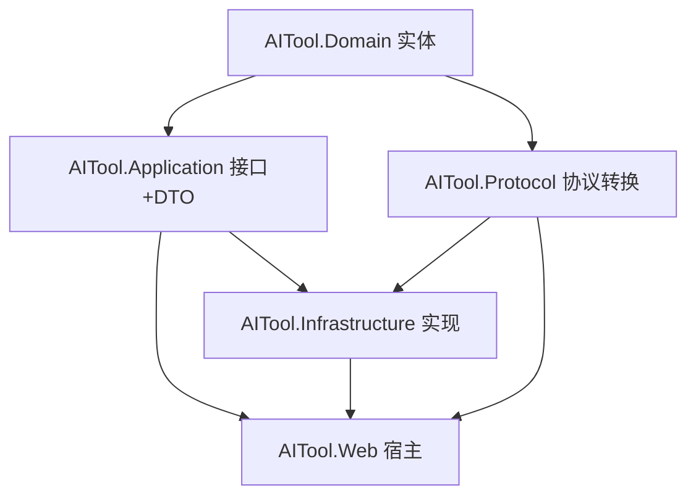
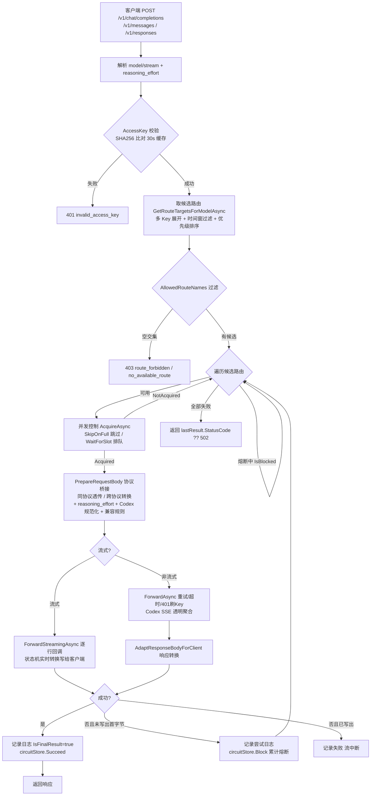

# AI Tool - 项目文档

## 项目简介

AI Tool 是一个 **AI API 网关 / 反向代理**，用于统一管理和转发多个 AI 服务站点的请求。它提供一个管理后台来管理站点、模型、路由规则、访问密钥，并通过 OpenAI/Anthropic 兼容协议对外提供代理服务，支持按优先级自动故障转移。

核心能力：
- 多站点管理（注册 OpenAI/Anthropic/Responses 兼容的 AI 服务站点，**一个站点挂多把 Key 主备调度**，各自独立并发计数与熔断）
- 统一模型库（不同站点同名模型归一化管理，支持强制覆盖 reasoning_effort、绑定兼容规则集）
- 路由规则（路由入口 + 有序候选实例队列，失败自动切换下一顺位；**支持时间规则**：全天 / 仅指定时间可用 / 指定时间不可用）
- 路由回退监控（从调用日志还原故障转移事件，展示哪些请求触发了路由跳转）
- 兼容规则集（转发前字段级变换：strip 剔除 / rename 重命名 / default 补默认值 / **keep_reasoning 保留思维链**，区分透传与中转作用域）
- 熔断保护（**站点+站点Key+模型维度**，连续失败达阈值临时屏蔽，面板可视化并可手动解除）
- 实时流式透传（OpenAI / Anthropic / Responses 三协议原生 SSE 流式转发）
- 跨协议桥接（OpenAI Chat Completions、Anthropic Messages、OpenAI Responses 三协议**任意两两转换**，流式与非流式都支持；独立 `AITool.Protocol` 项目承载）
- 并发控制（站点+模型维度限制最大并发，SkipOnFull 跳过 / WaitForSlot 排队两种策略）
- 访问密钥（统一对外 API Key 认证，支持**绑定允许的路由入口集合**）
- 模型检测（定时/手动探测模型可用性，Cron 任务 + 增量进度）
- 健康监控（模型可用率时间线）
- 对话测试（内置 Chat 页端到端测试代理链路，含流式与思考等级）
- 使用日志（Token 级用量追踪：**输入/缓存/输出三段口径**、重试次数、流中断、首字延迟；来源识别 claude-code / codex / open-code / zcode / deepseek-harness；**行级消耗金额**，USD/CNY 动态切换）
- 统计分析（用量趋势、模型分布、缓存命中率、延迟分位数等可视化仪表盘；**总消耗金额 + 成本趋势 + 模型成本分布**，查询时按价格表动态计价，历史数据自动兼容）
- 模型价格（**本地 JSON 价格表**（`model-pricing.json`，不入数据库），内置主流模型 USD 单价 seed；模型页可编辑、保存即生效；支持 **DeepSeek 类峰谷分档计价**；匹配自动归一化 namespace/日期/effort 后缀）
- 开发者调试（进程内环形调用追踪 + 客户端模拟器 + 并发/熔断监控 + **离线协议诊断台**（转换链路可视化/字段级对比/规则试运行/一键保存规则） + **SQL 迁移执行**（密码确认+事务+试运行+全量审计））
- OpenAI Responses API 代理（HTTP、WebSocket、Compact 三种模式）
- Codex 账号托管（OAuth/PKCE 登录、token 自动刷新、额度查询与缓存、冷却恢复、定期巡检、手动重置 credits）

---

## 文档导航

README 是全貌入口；`docs/` 下按主题提供**函数级**细节文档：

| 文档 | 内容 |
|------|------|
| [docs/architecture.md](docs/architecture.md) | 分层架构、依赖关系、Program.cs 启动流程、DI 全表、配置节、数据库与实体全字段、SqlSugar 陷阱 |
| [docs/proxy-pipeline.md](docs/proxy-pipeline.md) | 代理请求全链路函数级拆解（认证→路由→熔断→并发→桥接→转发→流式→用量） |
| [docs/protocol-bridge.md](docs/protocol-bridge.md) | AITool.Protocol 协议转换：方向矩阵、流式状态机、usage/cache 口径、keep_reasoning、Codex 规范化 |
| [docs/admin-api.md](docs/admin-api.md) | 代理端点 + 全部管理 API 端点表 |
| [docs/frontend.md](docs/frontend.md) | 前端工程：路由、页面功能、api 层、stores、composables、UI 规范 |
| [docs/debug-tools.md](docs/debug-tools.md) | 调试工具六页签：调用追踪 / 模拟器 / 并发 / 熔断 / 协议诊断 / SQL 迁移 |
| [docs/codex.md](docs/codex.md) | Codex 账号托管：OAuth、额度、冷却、巡检、credits、禁用状态矩阵 |
| [docs/testing.md](docs/testing.md) | 测试体系：策略、用例清单、usage 断言口径 |
| [docs/tools.md](docs/tools.md) | build.ps1 / publish.ps1 / ProtocolSyncCheck、仓库目录速查 |

历史专题文档：`docs/usage-token语义修复SQL.md`（usage 修复 SQL）、`docs/EF迁移SqlSugar数据修复SQL.md`、`docs/protocol-url-reference.md`（协议 URL 对照）、`docs/protocol-sync-report.md`（ProtocolSyncCheck 生成物，不入库）、`docs/codex-development-context.md`、`docs/avalonia-desktop-development-plan.md`。

---

## 技术栈

| 层级 | 技术 |
|------|------|
| 运行时 | .NET 8.0 (ASP.NET Core) |
| 数据库 | SQLite（SqlSugar CodeFirst 建表 + 自动补列，WAL 模式） |
| ORM | SqlSugar（`SqlSugarScope` 单例 + `AppDbContext` Scoped 适配层） |
| 任务调度 | Hangfire（InMemory 存储）+ 多个 BackgroundService |
| 后端 API | REST API + JWT Bearer（管理后台），AccessKey 自校验（代理端点） |
| 前端 | Vue 3 + TypeScript + Vite + Naive UI + Tailwind CSS + Pinia + Vue Router + ECharts + Axios |
| 桌面壳 | `AITool.Desktop`（Avalonia，复用同一套后端 API，独立构建） |
| 日志 | NLog（控制台 + Debug + 文件）+ 自定义 HTTP 异常日志过滤器 |
| API 文档 | Swagger / OpenAPI（`Swagger:Enabled` 可关，Testing 环境自动关闭） |
| 部署 | 同进程托管（前端 build 产物输出到 wwwroot，由 ASP.NET Core 同时服务 API 与静态文件） |
| 测试 | xUnit + FluentAssertions + 隔离 SQLite；前端 vitest |

> **架构说明**：「Vue 3 SPA + REST API + JWT 认证」前后端分离，但**同进程部署**：前端产物输出到 `src/AITool.Web/wwwroot`，非 `/api`、`/v1`、`/health`、`/hangfire` 的请求 fallback 到 `index.html` 交给 Vue Router（history 模式）。无 CORS 配置（同源）。

---

## 项目结构

```
AI-Tool/
├── src/
│   ├── AITool.Domain/           # 领域实体（SqlSugar 特性 POCO，sealed，16 表实体 + 1 规则 DTO）
│   ├── AITool.Application/      # 应用层接口和 DTO（纯接口定义，不含实现）
│   ├── AITool.Protocol/         # 协议转换库（ProxyProtocolBridge，零 NuGet 依赖纯静态）
│   ├── AITool.Infrastructure/   # 基础设施（SqlSugar、上游转发、Hangfire、熔断、Codex 解析）
│   ├── AITool.Web/              # 唯一宿主（Controllers + Program.cs + wwwroot 前端产物 + Codex 后台服务群）
│   └── AITool.Desktop/          # Avalonia 桌面壳（独立构建，HTTP 调用后端）
├── frontend/                    # Vue 3 前端工程（build 产物输出到 src/AITool.Web/wwwroot）
├── tests/
│   ├── AITool.ApplicationTests/ # 单元测试
│   └── AITool.IntegrationTests/ # 集成测试（WebApplicationFactory + 临时 SQLite）
├── tools/
│   └── ProtocolSyncCheck/       # 协议同步校验工具（与参考实现 CLIProxyAPI 字段级比对）
├── docs/                        # 细节文档（见上方导航）
├── build.ps1 / publish.ps1      # 一键构建 / 发布脚本
└── AiTool.slnx                  # 解决方案文件
```

**依赖关系：** `Domain` ← `Application` ← `Infrastructure` ← `Web`；`Protocol` 依赖 `Domain`，被 `Infrastructure` 与 `Web` 引用；`frontend` 与 `AITool.Desktop` 各自独立构建。



> ⚠️ `src/AITool.Core/`、`src/AITool.Admin/` 及 `tests/AITool.Core.IntegrationTests/`、`tests/AITool.Admin.IntegrationTests/` 目录下**只有 bin/obj 构建残留**（split 分支双宿主架构实验遗留，无源码、不在解决方案中），可安全删除，勿在其中开发。

---

## 分层架构（概览）

细节（含启动流程、DI 全表、实体全字段）见 [docs/architecture.md](docs/architecture.md)。

| 层 | 职责 |
|----|------|
| **Domain** | 16 个表实体 + 1 个 `CompatibilityRule` DTO，全部 `sealed`、`Guid` 主键、无导航属性（ID 手动关联）。关键实体：`Site`/`SiteKey`（多 Key）、`ModelLibraryItem`（含 OverrideReasoningEffort/CompatibilityProfileId）、`ProxyRouteEntry`/`ProxyRouteRule`（三级优先级 + 时间规则 AvailabilityMode/TimeRangesJson）、`ProxyAccessKey`（含 AllowedRouteNames 路由限定）、`ProxyUsageLog`（每次尝试一条，Input=不含缓存新输入）、`SqlMigrationExecution`（SQL 迁移审计）、`CodexAccount`、`SystemRuntimeSettings`（单例 Id=1） |
| **Application** | 接口与 DTO：`IProxyForwardService`、`IUsageLogService`、`ISystemRuntimeSettingsService`、Codex 接口族；纯静态工具 `ProxyProtocolResolver`（透传/桥接判定）、`SiteEndpointPathResolver`（端点路径） |
| **Protocol** | `static partial class ProxyProtocolBridge`（7 个 partial 文件）+ 流式状态类。三协议请求体/响应体/SSE 流式任意两两转换（Anthropic ↔ Responses 直转并保留 thinking 签名桥接）、usage 提取、兼容规则引擎、Codex 上游规范化。见 [docs/protocol-bridge.md](docs/protocol-bridge.md) |
| **Infrastructure** | `ProxyForwardService`（上游转发：重试/超时/401 刷 Key/流式逐行回调/Codex SSE 聚合）、`AppDbContext`+`SqlSugarSetup`（CodeFirst 差量补列）、`RouteCircuitStateStore`（熔断）、`ProxyUsageLogBatchWriter`（批量写日志）、`HangfireDetectionScheduler`、`ModelHealthRequestService`、Codex 解析器族（Credential/Jwt/Usage/ModelCatalog） |
| **Web** | 唯一进程宿主：代理控制器（OpenAi/Anthropic）、19 个管理 API 控制器、热路径缓存 `ProxyRequestMetadataCache`（TTL 30s + 显式失效 + 延迟刷新）、`ModelConcurrencyLimiter`、Codex 后台服务群、SPA 托管 |

### 实体关系图

```
Site ──1:N──> SiteKey (多把 Key，主备调度；熔断/并发按 Key 独立)
Site ──1:N──> SiteModelMapping <──N:1── ModelLibraryItem ──N:1──> CompatibilityProfile
Site <──1:1── CodexAccount (LinkedSiteId，ManagedSource="Codex" 隐藏站点，Responses 协议)

ProxyRouteEntry ──1:N──> ProxyRouteRule ──N:1──> Site (三级优先级 + 时间规则)
  (EntryName = ExternalModelName = 对外路由入口名)

ProxyAccessKey ──1:N──> ProxyUsageLog <──N:1── Site
  (AllowedRouteNames 限定可用的路由入口)

SystemRuntimeSettings (单例 Id=1)     SqlMigrationExecution (SQL 迁移审计)
DetectionTask ──1:N──> DetectionTaskExecution (─0:1─> ModelLibraryItem)
RefreshTokenRecord (JWT 刷新令牌)
```

---

## 核心业务流程

### 1. 代理请求流程（含故障转移、并发控制和跨协议桥接）

函数级拆解见 [docs/proxy-pipeline.md](docs/proxy-pipeline.md)。



要点：
- **回退语义**：只有尚未向客户端写出首字节的失败才回退下一条路由（流式一旦开始写即不可回退）
- **熔断**：键 = SHA256(SiteId+SiteKeyId+模型名) 合成 Guid（站点+Key+模型维度）；阈值/恢复时长运行时可配（默认 5 次 / 2 分钟）
- **usage 记录**：每次尝试一条（`AttemptIndex`），最终结果 `IsFinalResult=true`；`InputTokens` 为**不含缓存的新输入**，`Total = Input + Cached + Output`
- **来源识别**：`X-AITool-Source` 头优先，否则 User-Agent 识别 claude-code / codex / open-code / zcode / deepseek-harness，兜底 proxy

### 2. 协议桥接（ProxyProtocolBridge）

三协议任意两两转换，**透传优先**（站点声明 `SupportsOpenAi`/`SupportsAnthropic`/`SupportsResponses`，匹配即透传，不匹配才转换）。请求与响应方向矩阵、流式状态机、usage/cache 还原语义、keep_reasoning、Codex 字段剔除详见 [docs/protocol-bridge.md](docs/protocol-bridge.md)。

| 维度 | 说明 |
|------|------|
| 请求方向 | `PrepareRequestBody()`：统一入口，分发到各 Build*/Convert* 函数，后接 reasoning_effort → Responses 规范化(store=false/Codex 剔 12 字段) → 兼容规则 |
| 非流式响应 | `AdaptResponseBodyForClient()`：整包转换；失败返回空串保留回退资格 |
| 流式响应 | 增量状态机（逐分片实时转换）+ 整段聚合 + 非流式重放三种模式；惰性首写防空响应 |
| legacy Completions | `/v1/completions` 转 Chat 复用主链路，响应还原 text_completion 格式 |

### 3. 路由规则管理流程

路由入口（`ProxyRouteEntry.EntryName` 即客户端请求的 model 名）→ 候选实例队列（拖拽排序 = 优先级）→ 改动即自动保存（前端排队防并发）→ 时间规则草稿「确定」才保存（AllDay / AvailableOnly / Unavailable + HH:mm 区间）。保存语义：删除该入口旧规则按新顺序重建。

### 4. 模型检测流程

手动（单映射/按模型/全量，异步 taskId 增量进度）或 Cron 定时任务（Hangfire `detection-{taskId}`）→ `ModelHealthRequestService.ProbeMappingAsync` 发送随机数学题真实探测 → 回写 `SiteModelMapping.LastStatus` + UsageLog（Source="detection-task"）→ 模型健康页查看成功率时间线。

### 5. 模型导入流程

单站拉取 / 全站异步拉取（taskId 轮询）→ 标记已导入/未导入 → 勾选导入（预加载模型库字典防同名 UNIQUE 冲突，同名复用 `ModelLibraryItem`）→ 支持别名（自定义名作为对外路由名）。Codex 账号模型拉取同构（映射反查模型库）。

### 6. 对话测试流程

管理后台 Chat 页（JWT，无需 AccessKey）→ 复用同一套候选路由 + 故障转移 + 协议桥接；**不触发熔断**；Source="chat"；流式 SSE 命名事件（token/reasoning/meta/done/error），meta 含每段尝试明细；无路由时回退 SiteModelMapping 直查。

---

## API 端点汇总

完整端点表（含全部管理 API 与参数说明）见 [docs/admin-api.md](docs/admin-api.md)。

### 代理端点（面向客户端）

| 方法 | 路由 | 认证方式 | 说明 |
|------|------|----------|------|
| POST | `/v1/chat/completions` | `Authorization: Bearer {key}` | OpenAI Chat 代理（流式/非流式） |
| POST | `/v1/completions` | Bearer | Legacy Completions 代理 |
| POST | `/v1/embeddings` | Bearer | Embeddings 代理（仅 OpenAI 上游，禁流式） |
| POST | `/v1/responses` | Bearer | Responses API（HTTP 模式） |
| GET | `/v1/responses` | Bearer | Responses API（WebSocket 模式） |
| POST | `/v1/responses/compact` | Bearer | Responses Compact |
| GET | `/v1/models` · `/v1/models/{modelId}` | Bearer | 模型列表/详情（自动适配 Anthropic 头；AccessKey 路由限定过滤） |
| POST | `/v1/messages` | `x-api-key: {key}` | Anthropic Messages 代理（流式/非流式） |
| POST | `/v1/messages/count_tokens` | x-api-key | 本地 token 估算 |
| GET | `/health` | 无 | 健康检查 |

### 管理 API（面向管理后台，JWT）

| 控制器（`api/...`） | 主要端点 |
|--------------------|----------|
| `auth` | `status` / `login` / `refresh` / `logout` / `setup`（首次设密码） |
| `admin/dashboard` | `stats` |
| `admin/sites` | CRUD / toggle / bulk-delete / **export / import** / `/{id}/keys...`（多 Key CRUD） |
| `admin/site-catalog` | fetch-models / fetch-all-models / fetch-all-progress / import-selected |
| `admin/models` | CRUD / toggle / clear-all / **vendor-catalog 读写** / `/{id}/mappings` / mappings concurrency |
| `admin/route-rules` | entries CRUD / site-instances / models / discover-sites / list / save / toggle / delete |
| `admin/compatibility-profiles` | CRUD / toggle |
| `admin/access-keys` | list / `/{id}/plain`（复制完整密钥）/ create / toggle / delete / update-routes |
| `admin/detection` | matrix / probe / probe-model / probe-all / progress |
| `admin/detection-tasks` | CRUD / toggle / execute |
| `admin/model-health` | 面板 / monitor 增删 |
| `admin/route-fallback` | list / summary（UsageLog 还原回退事件） |
| `admin/chat` | models / targets / send / send-stream |
| `admin/usage-logs` | filters / list / request-detail / summary |
| `admin/analytics` | options / dashboard（重查询后台队列，Pending 返回 202 语义） |
| `admin/system` | settings 读写 / **clear-usage-logs** |
| `admin/developer/invocations` | init / list / `{traceId}` / concurrency / **circuit-breaker（查询/单条解除/全部解除）** / **protocol-diagnostics（离线协议诊断）** |
| `admin/sql-migrations` | 列表 / `{fileName}/execute`（密码确认 + 事务 + 试运行 + 审计） |
| `admin/codex` | OAuth / 凭证导入导出 / 账号 CRUD / 额度 / 模型 / 巡检 / reset-credits（详见 [docs/codex.md](docs/codex.md)） |
| `/hangfire` | Hangfire 仪表盘（未登录重定向登录页） |

---

## 管理后台页面

Vue 3 SPA，路由与页面功能明细见 [docs/frontend.md](docs/frontend.md)。

**侧边栏导航分区**（按功能开关联动显隐）：

```
概览       仪表盘(/) · 可视化分析(/analytics) · 对话(/chat)
资源管理   站点管理(/sites) · OAuth 管理(/codex)🔒 · 模型库(/models)
代理配置   路由管理(/routes) · 访问密钥(/access-keys)
监控运维   模型检测(/detection) · 检测任务(/detection-tasks) · 模型健康(/model-health)
           · 调试工具(/developer/invocations)🛠️ · 使用日志(/usage-logs) · 系统设置(/system/settings)
```

🔒 仅 `CodexFeaturesEnabled` 开启时显示；🛠️ 仅 `DeveloperFeaturesEnabled` 开启时显示。侧边栏左下角显示当前版本号与编译时间（读自后端程序集元数据）。

**调试工具六页签**（`/developer/invocations`，hash 深链）：调用调试（环形追踪 40 条/20 分钟，含每段尝试的转换后请求体）· 客户端模拟器（8 个端点）· 当前模型并发数检测 · 熔断监控（站点+模型维度，可手动解除）· 协议诊断（离线转换 + 链路可视化 + 字段对比 + 规则试运行 + 一键保存规则）· SQL 迁移（详见 [docs/debug-tools.md](docs/debug-tools.md)）。

**页面要点**：
- **站点管理**：多 Key 管理（优先级/启停/备注）、JSON/TSV 导入导出、远端模型拉取（单站/全站异步）
- **模型库**：模型分组（厂商图标卡片）+ 厂商规则（exact/wildcard/regex 匹配）两页签；编辑含 OverrideReasoningEffort 与兼容规则集绑定
- **路由管理**：候选实例队列拖拽排序、改动即存、时间规则草稿确认保存、兼容规则集页签（strip/rename/default/keep_reasoning × scope）
- **使用日志**：来源品牌图标（含 DeepSeek Harness）、模型列显示「路由入口名 -> 对外模型」、输入/缓存/输出三段 token、查看链路抽屉（同 RequestId 全部尝试）、5s 增量刷新
- **Codex**：账号额度 + 巡检两页签（额度窗口进度条、token 过期预警、缓存命中统计）
- **系统设置**：检测/代理（超时重试熔断并发）/日志/开发者功能/Codex 巡检分组卡；按来源/时间清空日志

---

## Web 层核心服务（速览）

注册方式与函数签名见 [docs/architecture.md](docs/architecture.md) 第 4 节。

| 服务 | 职责 |
|------|------|
| `ProxyRequestMetadataCache` | 代理热路径统一元数据缓存（AccessKey/设置/路由/兼容规则/并发上限），TTL 30s 兜底 + 管理写操作显式失效 + **延迟刷新**保证调用中路由稳定；熔断键 `BuildCircuitKey` 在此合成 |
| `ModelConcurrencyLimiter` | 站点+模型并发闸门（SkipOnFull/WaitForSlot，FIFO 排队， IDisposable 槽位） |
| `ProxyProtocolBridge` | **位于 AITool.Protocol 项目**（非 Web 层），三协议互转静态引擎 |
| `DeveloperInvocationTraceStore` | 内存环形调用追踪（40 条/20 分钟，SummarizeBody 长文本收缩） |
| `AnalyticsBackgroundQueryExecutor` | 统计重查询单消费者队列（容量 4 + 20s 结果缓存 + 版本失效） |
| `ModelVendorCatalogService` | 厂商图标/匹配规则目录（`model-vendor-catalog.json`，运行文件可编辑） |
| `AdminAuthService` | 管理密码（PBKDF2，兼容旧 MD5 透明升级，写回 appsettings.json） |
| `JwtTokenService` | access/refresh 签发与轮换吊销（RefreshTokenRecord 表） |
| `LoginRateLimitService` | IP 登录失败计数 + 锁定 |
| `SqlMigrationRunnerService` | SQL 迁移执行（目录白名单、密码确认、事务、试运行回滚、审计表） |
| `RouteCircuitStateStore`（Infra） | 熔断状态（内存，站点+Key+模型维度键） |
| `ProxyForwardService`（Infra） | 上游转发（重试/超时 CTS/401 刷 Key 重发/流式逐行回调/Codex SSE 聚合 `TryExtractResponsesCompletion`；**非流式 Codex 聚合在此内联实现，无独立 Bridge 类**） |
| `ProxyUsageLogBatchWriter`（Infra） | 日志批量写（Channel 4096 / 100 条 / 800ms，Testing 直写） |
| Codex 服务群 | 见 [docs/codex.md](docs/codex.md) |

---

## 启动流程（Program.cs）

细节（含行号与中间件顺序）见 [docs/architecture.md](docs/architecture.md) 第 2 节。概览：

```
1. 构建 WebApplication
   ├─ NLog + AppVersionInfo(1.0.1.8 + 构建期编译时间戳)
   ├─ Kestrel：默认 15029，MaxConcurrentConnections=500，请求体上限 100MB
   ├─ 响应压缩 / 控制器 + 异常过滤器 / MemoryCache
   ├─ JWT Bearer（/api/*）+ AdminAuthService + 登录限流
   ├─ Swagger（Testing 关闭；排除代理控制器）
   ├─ SqlSugar + AppDbContext；6 个 Typed HttpClient（含转发 SocketsHttpHandler 连接池 200）
   ├─ 业务服务 + 后台服务 + Hangfire(InMemory)
2. 启动初始化（scope）
   ├─ InitializeDatabase：CodeFirst 建表/补列 + PRAGMA(WAL) + MigrateLegacySiteKeys
   ├─ SiteUsageTracker 预热 / 检测任务注册到 Hangfire / 熔断参数注入 / 热路径缓存预热
3. 中间件：异常处理 → 响应压缩 → 静态文件(/assets 长缓存) → WebSocket → 认证授权
   → Swagger → 内联管理端鉴权(/api/admin/* 与 /hangfire) → /health → Hangfire 仪表盘
   → 日志清理 RecurringJob(每日 03:00) → MapControllers → SPA fallback(index.html)
```

数据库默认 `{运行目录}/aitool.db`（`ConnectionStrings:DefaultConnection` 可覆盖）。

---

## 数据库

- SQLite（WAL、synchronous=NORMAL、busy_timeout=5000），SqlSugar CodeFirst `InitTables` **差量补列只增不删**，不用 Migration
- 16 个表实体 + `CompatibilityRule` DTO（存于 `CompatibilityProfile.RulesJson`），全字段清单见 [docs/architecture.md](docs/architecture.md#5-数据库与实体16-表实体--1-dto)
- 关键唯一索引：`ModelLibraryItem.ModelName`、`SiteModelMapping(SiteId,RemoteModelName)`、`ProxyRouteEntry.EntryName`、`ModelHealthMonitor.ModelLibraryItemId`
- `ProxyUsageLog` 六个查询索引（RequestedAt/RequestId/(RequestedAt,Status)/TargetSiteId/AccessKeyId/AttemptedModel）
- DateTimeOffset 经 AOP 写前转本地时区 + 读取物化归一 +00:00（往返瞬时正确）
- 后台写串行化 `SerialExecuteAsync`（仅后台服务）；Web 请求路径依赖 WAL + busy_timeout
- 常见陷阱（Where 内调 C# 方法、Deleteable.Where 静默不执行等）见 [docs/architecture.md](docs/architecture.md#53-sqlsugar-细节与已知陷阱)

---

## 定时任务与后台服务

| 类型 | 任务 | 周期 | 说明 |
|------|------|------|------|
| Hangfire | `log-retention-prune` | 每日 03:00 | 清理过期使用日志 |
| Hangfire | `detection-{taskId}` | 各任务 Cron | 定时模型检测 |
| HostedService | `ProxyUsageLogBatchWriter` | 800ms/100 条 | 日志批量落库 |
| HostedService | `AnalyticsBackgroundQueryExecutor` | 队列驱动 | 重统计查询 |
| HostedService | `CodexTokenRefreshService` / `CodexCooldownRecoveryService` / `CodexInspectionService` | 周期 | 见 [docs/codex.md](docs/codex.md) |
| HostedService | `MemoryMaintenanceService` | 周期 | LOH 压缩 |

Hangfire 仪表盘 `/hangfire`（未登录重定向登录页）。

---

## 关键设计决策

1. **SqlSugar CodeFirst 差量补列**：改实体启动自动补列，保持旧库兼容，无需手写 ALTER TABLE
2. **无导航属性**：ID 手动关联 + 字典查找，避免查询翻译问题
3. **内存熔断（站点+站点Key+模型维度）**：连续失败达阈值才熔断（防单次失败误屏蔽）；键与路由规则解耦，规则增删重排不影响熔断状态；重启丢失（内存态）
4. **多 Key 主备调度**：缓存层把「路由 × 多 Key」展开为多候选，复用优先级/熔断/并发机制，各 Key 独立并发计数
5. **三协议桥接独立成库**：`AITool.Protocol` 零依赖纯静态，转换失败返回空串/置 ConversionFailed 保留回退资格；透传优先
6. **usage 三段口径**：`InputTokens=不含缓存新输入`，跨协议输出时按目标协议语义还原（Anthropic input 含缓存 / OpenAI prompt_tokens 含缓存命中）；流式累计用覆盖语义防中间层重复累计
7. **每次尝试记录日志**：AttemptIndex + IsFinalResult + FallbackTriggered，完整还原故障转移链路（回退监控页由此还原）
8. **批量日志写入**：后台 Channel 聚合，热路径不等待 SQLite 写
9. **元数据缓存 + 延迟刷新**：TTL 30s 兜底 + 显式失效；调用中的模型路由快照稳定（Defer 机制）
10. **增量进度报告**：检测进度 LastReportedCount 只返回新增
11. **兼容规则集独立维护**：多模型引用；scope 区分透传/中转；keep_reasoning 在转换前检查防 thinking 丢失
12. **Chat 不触发熔断**：对话测试独立尝试，不污染代理链路熔断状态
13. **后台统计单消费者队列**：防昂贵聚合查询打挂 SQLite
14. **离线协议诊断**：只调内存桥接，不触发转发/不用密钥/不写记录；试运行规则与真实链路语义一致；可一键把缺失字段修复保存为规则集
15. **SQL 迁移安全执行**：只执行服务器 sql-migrations 目录脚本（不接收 SQL 文本）、密码确认、事务回滚、试运行、全量审计（SqlMigrationExecution 表）
16. **Codex 托管**：账号⇆隐藏站点复用全链路；多种禁用状态（总开关/手动/自动/冷却）相互区分避免误启用；401 实时刷凭证重发

---

## 快速开始

### 生产部署（同进程托管）

```bash
# 方式一：一键构建脚本（Windows PowerShell）
.\build.ps1        # 前端 npm build + 后端 dotnet build

# 方式二：手动
cd frontend && npm install && npm run build && cd ..
dotnet build

# 运行（默认 http://0.0.0.0:15029）
cd src/AITool.Web
dotnet run
```

访问 `http://localhost:15029`，首次访问引导设置管理密码（JWT）。

发布到独立目录（保留数据库与配置、自动重启）：

```powershell
.\publish.ps1 [-TargetDir "D:\Tool\AiTool"]
```

### 开发模式（前后端分离调试）

```bash
# 终端 1：后端 API（15029）
cd src/AITool.Web && dotnet run

# 终端 2：前端 dev server（5173，proxy 转发 /api /v1 /health 到后端）
cd frontend && npm run dev
```

访问 `http://localhost:5173`（热更新）。后端端口非 15029 时：`VITE_API_TARGET=http://127.0.0.1:<端口> npm run dev`。

---

## 测试

```bash
dotnet test                              # 后端全部测试（仓库根目录）
dotnet test tests/AITool.IntegrationTests/AITool.IntegrationTests.csproj   # 单项目
cd frontend && npm run test              # 前端 vitest
cd frontend && npm run type-check        # vue-tsc 类型检查
```

- **单元测试**（`AITool.ApplicationTests`，14 个测试文件，84 个执行用例）：业务服务 + 反射测转发私有方法，临时 SQLite 隔离
- **集成测试**（`AITool.IntegrationTests`，24 个测试文件，241 个执行用例）：`WebApplicationFactory<Program>` 完整宿主 + Fake 转发服务 + 每工厂独立临时库；覆盖代理端到端、跨协议桥接、故障转移、并发、鉴权、SQL 迁移、协议诊断、DateTimeOffset 时区一致性等
- **usage 断言口径**（重要）：Input=不含缓存新输入；转回 OpenAI 时 prompt_tokens 必须含缓存；流式累计覆盖语义。详见 [docs/testing.md](docs/testing.md#4-usage-token-断言口径重要对应-2026-08-的两次语义修复)

用例级清单见 [docs/testing.md](docs/testing.md)。

---

## 典型使用场景

### 配置一个 OpenAI 代理
1. 站点管理页添加 OpenAI 兼容站点（名称/Base URL/多把 Key 设优先级）
2. 拉取模型列表勾选导入（可设别名作为对外路由名）
3. 路由管理页创建入口、拖拽候选实例设置优先级（可选时间规则）
4. 访问密钥页创建对外 Key（可限定允许的路由入口）
5. 客户端 `POST http://your-host/v1/chat/completions`，`Authorization: Bearer {key}`，body 的 model 填路由入口名

### 多站点故障转移
同一入口配置多站点优先级 → 请求自动按序尝试、失败切换、成功即止 → 连续失败站点熔断临时屏蔽 → 使用日志查看重试与回退详情，模型健康「路由回退」页看回退事件

### 跨协议混合使用
注册 Anthropic 与 OpenAI/Responses 站点为同一入口配路由 → 客户端协议与站点协议不一致时网关自动桥接（请求/响应/流式 SSE 全维度）→ 协议诊断页可离线复现转换问题

### Codex 账号托管
系统设置开启 Codex → OAuth/PKCE 登录或导入凭证（自动建隐藏站点）→ 拉取模型导入并配路由 → 后台自动刷新 token、周期巡检额度、被动冷却恢复、额度耗尽自动禁用 → 需要时消耗 reset credit 手动重置。详见 [docs/codex.md](docs/codex.md)

### 兼容规则集
路由管理「兼容规则集」页签新建（如 strip `metadata`、rename `reasoning_effort→effort`、default `store=false`、keep_reasoning 保留思维链）→ 模型库为对应模型绑定 → 转发前按透传/中转作用域自动应用

### 协议转换问题排查
开启开发者功能 → 调试工具「协议诊断」页签（或从调用追踪一键跳转预填）→ 选方向/协议/流式，粘 payload → 查看转换链路（含函数名）、事件映射、字段对比、缺失字段 → 一键把修复保存为兼容规则集。全程不调上游、不用密钥、不写记录

### 历史数据修复（SQL 迁移）
编写修复 SQL 放到服务器 `sql-migrations/` 目录 → 调试工具「SQL 迁移」页签 → 预览 → 输入管理员密码试运行（事务内执行后回滚）→ 确认后正式执行 → 审计记录可查（含 hash/行数/耗时/IP）

### 定时检测模型可用性
检测任务页创建 Cron 任务（可限定模型）→ 自动探测回写状态 → 模型健康页看成功率时间线 → 使用日志看探测记录（Source="detection-task"）

### 用量分析和监控
使用日志页（三段 token、来源图标、链路详情）→ 统计分析页（趋势/分布/缓存命中/分位数/下钻）→ 系统设置调整超时/重试/熔断/并发/日志保留 → 调试工具追踪全链路
