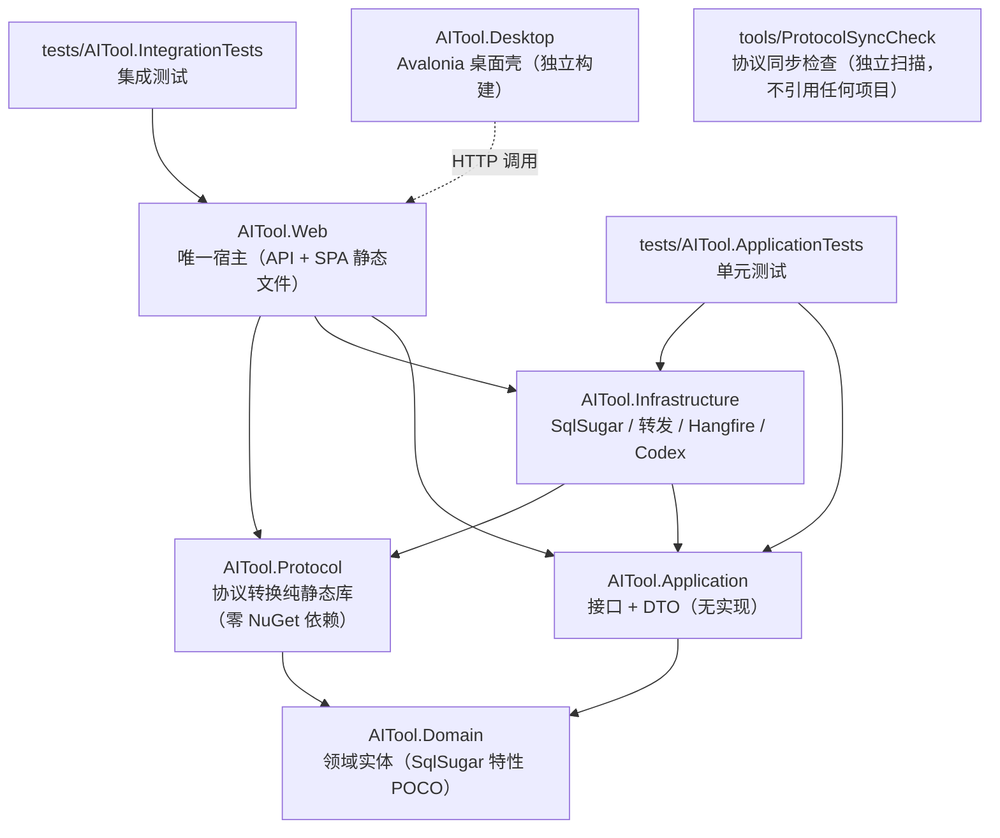

# 架构与启动流程（函数级）

> 本文是 [README.md](../README.md) 的架构细节篇，覆盖：项目分层、依赖关系、`Program.cs` 启动流程、依赖注入全表、配置节、数据库与实体全量字段、后台服务。
> 代理请求转发链路的函数级细节见 [proxy-pipeline.md](proxy-pipeline.md)；协议转换见 [protocol-bridge.md](protocol-bridge.md)。

---

## 1. 解决方案组成与依赖关系

解决方案文件 `AiTool.slnx`（新版 XML 格式）包含 9 个工程：



| 项目 | TargetFramework | 引用 | 关键 NuGet |
|------|-----------------|------|-----------|
| `AITool.Domain` | net8.0 | 无 | SqlSugarCore 5.1.4.215 |
| `AITool.Application` | net8.0 | Domain | 无 |
| `AITool.Protocol` | net8.0 | Domain（仅用 `CompatibilityRule`） | **无**（只用 BCL `System.Text.Json`） |
| `AITool.Infrastructure` | net8.0 | Application + Protocol | Hangfire.Core、SqlSugarCore、Newtonsoft.Json |
| `AITool.Web` | net8.0 (Web SDK) | Application + Infrastructure + Protocol | Hangfire.AspNetCore/InMemory、JwtBearer 8.0.12、NLog.Web.AspNetCore、Swashbuckle 6.9.0 |
| `AITool.Desktop` | net8.0 | 无（HTTP 调用后端） | Avalonia |
| `tools/ProtocolSyncCheck` | net8.0 | 无 | 无 |

- `AITool.Web` 的 `InternalsVisibleTo` 指向 `AITool.IntegrationTests`，集成测试可直接构造内部类型（`public partial class Program` 声明在 `Program.cs:543`，供 `WebApplicationFactory<Program>` 使用）。
- **历史残留提示**：`src/AITool.Core/` 与 `src/AITool.Admin/` 目录下只有 `bin/`、`obj/` 构建产物，**没有源码，也不在解决方案中**。它们是 `split-core-admin-architecture` 分支（Core 代理宿主 5029 + Admin 管理宿主 5030 双进程架构实验）切回 master 后的遗留物，功能已全部合并回单宿主 `AITool.Web`，目录可安全删除。`tests/AITool.Core.IntegrationTests/`、`tests/AITool.Admin.IntegrationTests/` 同理。

### 各层职责

| 层 | 职责 | 约束 |
|----|------|------|
| Domain | 16 个表实体 + 1 个规则 DTO，`SugarTable`/`SugarColumn`/`SugarIndex` 特性标注 | 全部 `sealed`，无导航属性，`Guid` 主键（`SystemRuntimeSettings` 固定 `Id=1`） |
| Application | 接口与 DTO（`IProxyForwardService`、`ISystemRuntimeSettingsService`、Codex 接口族、`ProxyProtocolResolver`、`SiteEndpointPathResolver` 等纯静态工具） | 不含实现 |
| Protocol | `ProxyProtocolBridge`（6 个 partial 文件约 7000 行）+ 5 个流式状态类，三协议互转 | 纯静态、无 IO、无状态（状态显式由调用方持有） |
| Infrastructure | `ProxyForwardService`（上游 HTTP 转发）、`AppDbContext`/`SqlSugarSetup`（持久化）、`RouteCircuitStateStore`（熔断）、`ProxyUsageLogBatchWriter`（批量写日志）、`HangfireDetectionScheduler`、`ModelHealthRequestService`、Codex 解析器族 | 被 Web 引用；故障转移**编排**不在这一层（在 Web 控制器） |
| Web | 唯一进程宿主：代理控制器、管理 API 控制器、`Program.cs`、热路径缓存/并发/熔断联动、Codex 后台服务群、SPA 静态文件托管 | — |

---

## 2. Program.cs 启动流程（`src/AITool.Web/Program.cs`，共 543 行）

按执行顺序分 9 个阶段：

### 2.1 日志与版本（L27-40）
- `WebApplication.CreateBuilder(args)`（L27）
- `ClearProviders()` → `AddConsole()` → `AddDebug()` → `Host.UseNLog()`（L29-32）。NLog 规则见 `nlog.config`：`Startup` logger ≥Info 写 `logs/{date}/startup.log`；全局 ≥Error 写 `error.log`
- 版本号硬编码 `applicationVersion = "1.0.1.8"`（L36）；`ReadBuildTimestamp()`（L476-489）读取构建期注入的程序集 `AssemblyMetadata:BuildTimestamp`（csproj L15 注入，兼容单文件/独立发布），二者打包成 `AppVersionInfo` 单例（L40 `AddSingleton(new AppVersionInfo(...))`）。前端侧边栏左下角展示 `AI Tool v{version}` + `Build {编译时间}`（见 [frontend.md](frontend.md)）

### 2.2 Kestrel（L42-51）
- `Server:Port` 配置默认 **15029**，`UseUrls("http://0.0.0.0:{port}")`
- `ConfigureKestrel`：`MaxConcurrentConnections=500`、`KeepAliveTimeout=130s`、`MaxRequestBodySize=100MB`（多模态 base64 图片需要）

### 2.3 基础服务（L53-65）
- `AddResponseCompression`（`EnableForHttps=true`，L54-57）
- `AddControllers()` + 全局过滤器 `HttpExceptionLoggingFilter`（L60-63）
- `AddMemoryCache()`（L64）；`AddScoped<HttpExceptionLoggingFilter>()`（L65）

### 2.4 JWT 认证（L67-110）
- `Configure<JwtOptions>("Jwt")`；`AddScoped<JwtTokenService>()`；`AddSingleton<LoginRateLimitService>()`（登录暴力破解防护）
- `AddAuthentication(JwtBearer).AddJwtBearer`：HS256 对称密钥，ValidateIssuer/Audience/Lifetime/IssuerSigningKey，`ClockSkew=30s`；`OnChallenge`（L95-107）把默认 401 改写为 JSON `{success=false, message, errorCode="unauthenticated"}`
- 注释明确分工：`/api/*` 走 Bearer；代理 `/v1/*` **不走 ASP.NET 认证**，由控制器自校验 AccessKey
- `AddAuthorization()`；`AddSingleton<AdminAuthService>()`

### 2.5 Swagger（L112-178）
- 开关：非 Testing 环境 && `Swagger:Enabled`（默认 true）；**Testing 环境强制关闭**
- `DocInclusionPredicate` 排除 `OpenAiProxy`/`AnthropicProxy` 控制器（SSE 流式端点不进文档）
- 注入 Web/Application/Infrastructure 三个程序集的 XML 注释文件

### 2.6 数据库与上游 HttpClient（L180-228）
- 数据库文件默认 `{BaseDirectory}/aitool.db`，连接串优先 `ConnectionStrings:DefaultConnection`
- `AddSqlSugar(connectionString)`（扩展方法 `SqlSugarSetup.AddSqlSugar`，`Infrastructure/Persistence/AppDbContext.cs:166`）
- `Configure<ProxyForwardingOptions>` / `Configure<CodexUpstreamOptions>`（Codex 上游伪装版本 `0.133.0`）
- 6 个 Typed HttpClient（详见第 5 节表格）：`ISiteCatalogClient`(默认超时)、`ICodexOAuthClient`(20s)、`ICodexModelFetcher`(30s)、`ICodexQuotaService`(20s)、`IProxyForwardService`(SocketsHttpHandler 连接池)、`ICodexResetCreditsService`(30s)
- `AddScoped<ModelHealthRequestService>()`、`AddScoped<SiteKeySelector>()`

### 2.7 代理热路径单例与后台服务（L230-289）
逐条注册（完整语义见第 4 节 DI 全表）：`ProxyUsageLogBatchWriter`(+HostedService)、`SiteUsageTracker`、`MemoryMaintenanceService`、`CodexTokenRefreshService`、`CodexCooldownRecoveryService`、`DeveloperInvocationTraceStore`、`ModelConcurrencyLimiter`、`UsageLogService`、`RouteCircuitStateStore`、`ProxyRequestMetadataCache`、`ModelVendorCatalogService`、`SiteCascadeDeleter`、`CodexAccountProvisioner`、`CodexCredentialRefreshService`、`CodexQuotaCooldownService`、`CodexResetCreditsService`、`CodexFeatureToggleAttribute`、`CodexInspectionToggleAttribute`、`CodexInspectionService`(+HostedService)、`LogRetentionService`、`SystemRuntimeSettingsService`、**`SqlMigrationRunnerService`**、`HangfireDetectionScheduler`、`AnalyticsBackgroundQueryExecutor`(+HostedService)、`AddHangfire(InMemoryStorage)` + `AddHangfireServer()`

### 2.8 启动作用域初始化（L291-338，`builder.Build()` 之后）
1. `SqlSugarSetup.InitializeDatabase(db, logger)` — CodeFirst 建表/差量补列 + PRAGMA（WAL / synchronous=NORMAL / cache_size=-65536 / busy_timeout=5000），随后 `MigrateLegacySiteKeys` 幂等迁移（把自建站点 `Site.ApiKey` 复制成一条 Priority=0 的默认 `SiteKey`；Codex 托管站点不迁移）。失败不阻断启动
2. `SiteUsageTracker.WarmupAsync()` — 从 `ProxyUsageLogs` 取最近 7 天按 `TargetSiteId` 分组 Max(RequestedAt) 预热站点使用时间
3. `HangfireDetectionScheduler.ScheduleAllAsync()` — 把所有启用的检测任务注册为 RecurringJob（失败仅告警）
4. 非 Testing 环境：预热 `ProxyRequestMetadataCache.GetRuntimeSettingsAsync()`（避免首请求查库）
5. 读运行时设置并 `RouteCircuitStateStore.UpdateOptions(恢复分钟, 失败阈值)` 初始化熔断参数

### 2.9 中间件管道（L340-471，按注册顺序）
1. 启动日志 + 控制台打印本机地址（`GetLocalIpAddress()` L504-516）
2. 非 Testing：`UseExceptionHandler`（记录 Path/Method/TraceId/QueryString/RequestBody；`OperationCanceledException` 静默；返回 500 JSON `{"message":"服务器内部异常"}`）
3. `UseResponseCompression()`
4. `UseStaticFiles`：`/assets/*` → `Cache-Control: public, max-age=31536000, immutable`；其余（index.html）→ `no-cache`
5. `UseWebSockets()`（`/v1/responses` WebSocket 模式使用）
6. `UseAuthentication()` → `UseAuthorization()`
7. Swagger（`UseSwagger` + `UseSwaggerUI`，必须位于 SPA fallback 之前）
8. **内联管理端鉴权中间件**（L414-447）：Testing 环境或非 `/api/admin/*` 且非 `/hangfire` 直接放行（交给 SPA fallback）；已认证放行；未认证的 `/api/admin/*` 返回 401 JSON（`IsAdminApiRequest` L492-495）；未认证的 `/hangfire` 重定向 `/login?returnUrl=...`
9. `MapGet("/health")` — 返回 `{status:"ok"}`（集成测试入口）
10. `UseHangfireDashboard("/hangfire")`
11. `RecurringJob.AddOrUpdate<ILogRetentionService>("log-retention-prune", PruneAsync, "0 3 * * *")` — 每日 03:00 清理过期使用日志
12. `MapControllers()`
13. 非 Testing：`MapFallbackToFile("index.html")` — SPA history 路由 fallback

> **无 CORS 配置**：全代码无 `AddCors`/`UseCors`，SPA 与 API 同源部署（开发模式由 Vite proxy 转发）。

---

## 3. 配置节结构

`appsettings.json`：

| 节 | 内容 |
|----|------|
| `Logging:LogLevel` | Default=Information；Microsoft.AspNetCore / System.Net.Http.HttpClient 等降噪为 Warning |
| `Server:Port` | 15029 |
| `ProxyForwarding` | `RequestTimeoutSeconds: 60`、`RetryCount: 1`（Development 覆盖为 20/0 快速失败） |
| `CodexUpstream` | `ClientVersion: "0.133.0"`（向上游伪装的 codex_cli_rs 版本） |
| `AdminAuth:PasswordHash` | PBKDF2 哈希（`pbkdf2$100000$salt$hash`）；`AdminAuthService.SetPasswordAsync` 运行时直接改写本文件并 `Reload()` 配置 |
| `Jwt` | Issuer/Audience=`AITool`、SigningKey（≥32 字节）、AccessTokenMinutes=15、RefreshTokenDays=7 |
| `Swagger:Enabled` | 默认 true |

代码读取但无默认文件的可选节：`ConnectionStrings:DefaultConnection`（数据库位置）、`SqlMigrations:Directory`（SQL 迁移目录，测试用）。

"Testing" 是集成测试通过 `WebApplicationFactory` 使用的环境名（`IsEnvironment("Testing")` 分支：Swagger 关闭、异常处理器关闭、缓存预热跳过、SPA fallback 关闭、鉴权中间件放行）。

---

## 4. 依赖注入全表

| 注册 | 生命周期 | 说明 |
|------|----------|------|
| `ISqlSugarClient`（`SqlSugarScope`） | Singleton | SqlSugar 线程安全单例客户端 |
| `AppDbContext` | Scoped | SqlSugar 适配层（保持 EF 时代属性名） |
| `SemaphoreSlim`（DB 串行化锁） | Singleton | 后台 DB 操作串行化（仅后台服务使用） |
| `AppVersionInfo` | Singleton（实例） | 版本号 1.0.1.8 + 构建期编译时间戳 |
| `HttpExceptionLoggingFilter` | Scoped + 全局过滤器 | API 异常统一日志 |
| `ISiteCatalogClient` → `OpenAiSiteCatalogClient` | HttpClient Typed | 拉取上游站点模型列表 |
| `ModelHealthRequestService` | Scoped | 模型健康探测（写 UsageLog） |
| `SiteKeySelector` | Scoped | 站点级单次调用取活动密钥（Priority 最小） |
| `IProxyForwardService` → `ProxyForwardService` | HttpClient Typed | 上游转发（`SocketsHttpHandler`：MaxConnectionsPerServer=200、PooledConnectionLifetime=2min、IdleTimeout=30s；HttpClient.Timeout=InfiniteTimeSpan，真实超时按请求 CTS 控制） |
| `IUsageLogService` → `UsageLogService` | Singleton | 使用日志入队（异步批量落库） |
| `ISystemRuntimeSettingsService` → `SystemRuntimeSettingsService` | Scoped | 系统运行时配置（含 Codex 总开关联动） |
| `ProxyUsageLogBatchWriter` | Singleton + HostedService | 日志批量写（Channel 4096 / 100 条 / 800ms） |
| `SiteUsageTracker` | Singleton | 站点最近使用时间内存映射（巡检零 DB 判断） |
| `RouteCircuitStateStore` | Singleton | 熔断状态（内存） |
| `ModelConcurrencyLimiter` | Singleton | 站点+模型并发闸门（Skip/Wait 策略） |
| `ProxyRequestMetadataCache` | Singleton | 代理热路径元数据缓存（TTL 30s + 显式失效 + 延迟刷新） |
| `DeveloperInvocationTraceStore` | Singleton | 开发者调用追踪环形缓冲（40 条 / 20 分钟） |
| `AnalyticsBackgroundQueryExecutor` | Singleton + HostedService | 统计分析单消费者后台查询队列 |
| `ModelVendorCatalogService` | Singleton | 厂商图标/匹配规则目录（model-vendor-catalog.json） |
| `AdminAuthService` | Singleton | 管理密码（PBKDF2，兼容旧 MD5 透明升级） |
| `JwtTokenService` | Scoped | JWT 签发/刷新/吊销 |
| `LoginRateLimitService` | Singleton | IP 登录失败计数 + 锁定 |
| `ILogRetentionService` → `LogRetentionService` | Scoped | 过期日志清理 |
| `HangfireDetectionScheduler` | Singleton | 检测任务 → Hangfire RecurringJob |
| `SqlMigrationRunnerService` | Scoped | 调试工具「SQL 迁移」页签后端（见 [debug-tools.md](debug-tools.md)） |
| `ICodexOAuthClient` → `CodexOAuthClient` | HttpClient Typed (20s) | OAuth/PKCE（single-flight 刷新） |
| `ICodexModelCatalog` → `CodexModelCatalog` | Singleton | Codex 静态模型目录 |
| `ICodexModelFetcher` → `CodexModelFetcher` | HttpClient Typed (30s) | chatgpt.com 动态模型拉取 |
| `ICodexQuotaService` → `CodexQuotaService` | HttpClient Typed (20s) | 额度查询（30s 缓存 + single-flight） |
| `ICodexQuotaCooldownService` → `CodexQuotaCooldownService` | Scoped | 额度被动冷却与重置 |
| `ICodexResetCreditsService` → `CodexResetCreditsService` | HttpClient Typed (30s) | 重置 credits 查询/消耗 |
| `CodexAccountProvisioner` | Scoped | 账号供给（自动创建隐藏 Site + 路由） |
| `CodexCredentialRefreshService` | Scoped | 代理命中 Codex 401 时即时刷凭证 |
| `CodexTokenRefreshService` | HostedService | 周期刷新 OAuth token |
| `CodexCooldownRecoveryService` | HostedService | 冷却到期恢复 |
| `CodexInspectionService` | Singleton + HostedService | 周期额度巡检 + 自动禁用 |
| `CodexFeatureToggleAttribute` / `CodexInspectionToggleAttribute` | Scoped（ServiceFilter） | Codex 功能 gating，关闭时 404 |
| `MemoryMaintenanceService` | HostedService | 周期 `GC.Collect(2, Forced, Blocking)` 压缩 LOH |
| `SiteCascadeDeleter` | Scoped | 站点级联删除（映射/规则/空入口清理） |

**静态工具类**（无 DI）：`HttpLogFormatter.FormatBody`（日志体截断脱敏）、`ConsoleProxyLogFormatter.BuildSummary`（失败请求单行控制台摘要）、`PasswordHasher.Hash/Verify`（PBKDF2 100k 迭代）、`QuotaCachePolicy.TryReuseQuota`（巡检缓存复用策略）、`SiteEndpointPathResolver`、`ProxyProtocolResolver`、`ProxyProtocolBridge`（全部在 Application/Protocol 层）。

---

## 5. 数据库与实体（16 表实体 + 1 DTO）

引擎 SQLite（WAL），初始化 `SqlSugarSetup.InitializeDatabase`（`Infrastructure/Persistence/AppDbContext.cs`）：`CodeFirst.InitTables` **差量更新只增不删**，自动补齐历史库缺失列；不使用 EF Migration。

### 5.1 实体总览

| 命名空间 | 实体 | 表名 | 索引 |
|----------|------|------|------|
| `Sites` | `Site` | Sites | — |
| `Sites` | `SiteKey` | SiteKeys | `IX_SiteKeys_SiteId` |
| `Models` | `ModelLibraryItem` | ModelLibraryItems | `UX_..._ModelName`（唯一） |
| `Models` | `ModelHealthMonitor` | ModelHealthMonitors | `UX_..._ModelLibraryItemId`（唯一） |
| `SiteCatalog` | `SiteModelMapping` | SiteModelMappings | `UX_..._SiteId_RemoteModelName`（唯一） |
| `Proxy` | `ProxyRouteEntry` | ProxyRouteEntries | `UX_..._EntryName`（唯一） |
| `Proxy` | `ProxyRouteRule` | ProxyRouteRules | `IX_..._ExternalModelName_Priority`；`IX_..._ExternalModelName_IsEnabled_Priorities`（含 ModelPriority/InstancePriority/Priority） |
| `Proxy` | `ProxyAccessKey` | ProxyAccessKeys | `IX_..._AccessKeyHash_IsEnabled` |
| `Proxy` | `ProxyUsageLog` | ProxyUsageLogs | RequestedAt / RequestId / (RequestedAt,Status) / TargetSiteId / AccessKeyId / AttemptedModel 共 6 个索引 |
| `Proxy` | `CompatibilityProfile` | CompatibilityProfiles | — |
| `Operations` | `SystemRuntimeSettings` | SystemRuntimeSettings | 单例行 Id=1 |
| `Operations` | `SqlMigrationExecution` | SqlMigrationExecutions | `IX_..._FileName_ExecutedAt`（SQL 迁移审计） |
| `Codex` | `CodexAccount` | CodexAccounts | LinkedSiteId、TokenExpiresAt |
| `Auth` | `RefreshTokenRecord` | RefreshToken | Token 主键（string） |
| `Detection` | `DetectionTask` | DetectionTasks | — |
| `Detection` | `DetectionTaskExecution` | DetectionTaskExecutions | `IX_..._StartedAt` |
| `Proxy`（DTO） | `CompatibilityRule` | —（存于 CompatibilityProfile.RulesJson） | — |

### 5.2 实体全字段清单

以下为 16 个实体 + 规则 DTO 的完整字段（伪 C#，来源为各实体源文件，含关键语义注释）。

**Site**（`Domain/Sites/Site.cs`）

```csharp
sealed class Site
{
    Guid Id;                      // 主键
    string Name;                  // 站点名称（≤200）
    string BaseUrl;               // 站点根地址（≤500）
    string EndpointPathMode = "standard-root";  // standard-root 自动补 /v1/；versioned-base 直接追加
    string ApiKey;                // 保留兼容字段：Codex 托管站点仍用；自建站点实际密钥在 SiteKey 表
    string ProtocolType = "OpenAI";   // OpenAI / Anthropic / Responses
    bool SupportsOpenAi;          // 三个能力位决定透传 or 桥接
    bool SupportsAnthropic;
    bool SupportsResponses;       // 原生 Responses 支持（支持则透传，否则转换）
    bool IsEnabled = true;
    DateTimeOffset CreatedAt;
    string? ManagedSource;        // null=自建；"Codex"=托管隐藏站点（页面过滤依据）
    string? ExtraHeadersJson;     // 自定义转发头 JSON（Codex 存 Originator/ChatGPT-Account-Id/UA）
}
```

**SiteKey**（`Domain/Sites/SiteKey.cs`）

```csharp
sealed class SiteKey
{
    Guid Id;
    Guid SiteId;                  // 索引
    string KeyValue;              // 实际密钥值（≤500）
    string? Remark;               // 备注，如「主号」「备用号」（≤200）
    int Priority;                 // 越小越优先（主备调度）
    bool IsEnabled = true;
    DateTimeOffset CreatedAt;
}
// 缓存层把「路由 × 多 Key」展开为多候选，各自独立熔断/并发计数
```

**ModelLibraryItem**（`Domain/Models/ModelLibraryItem.cs`）

```csharp
sealed class ModelLibraryItem
{
    Guid Id;
    string ModelName;             // 统一模型名 = 对外路由入口名（唯一索引，≤200）
    string DisplayName;           // 页面显示名（≤200）
    string ModelType = "chat";    // 固定，兼容旧字段
    string OverrideReasoningEffort;  // 强制覆盖思考等级；空=透传（low/medium/high/xhigh/max/自定义）
    Guid? CompatibilityProfileId;    // 绑定的兼容规则集；null=不应用
    bool IsEnabled = true;
    DateTimeOffset CreatedAt;
}
```

**ModelHealthMonitor**（`Domain/Models/ModelHealthMonitor.cs`）：`Id`、`ModelLibraryItemId`（唯一索引）、`CreatedAt`。标记健康页展示的模型。

**SiteModelMapping**（`Domain/SiteCatalog/SiteModelMapping.cs`）

```csharp
sealed class SiteModelMapping
{
    Guid Id;
    Guid SiteId;                     // FK → Site
    Guid ModelLibraryItemId;         // FK → ModelLibraryItem
    string RemoteModelName;          // 站点上的实际模型名（≤200）；(SiteId, RemoteModelName) 唯一
    string LastStatus = "unknown";   // 最后拉取/检测状态（≤50）
    int MaxConcurrency;              // 最大并发，0=不限
    bool IsEnabled = true;
    DateTimeOffset? LastCheckedAt;   // 最后检测时间
}
```

**ProxyRouteEntry**（`Domain/Proxy/ProxyRouteEntry.cs`）：`Id`、`EntryName`（唯一索引，对外暴露的模型入口名）、`CreatedAt`。一个入口挂多条规则的逻辑容器。

**ProxyRouteRule**（`Domain/Proxy/ProxyRouteRule.cs`）

```csharp
sealed class ProxyRouteRule
{
    Guid Id;
    string ExternalModelName;     // = ProxyRouteEntry.EntryName = ModelLibraryItem.ModelName（索引族）
    string UpstreamModelName;     // 上游模型组名（日志标记）
    Guid SiteId;                  // FK → Site
    string SiteModelName;         // 站点上的模型名（≤200）
    int Priority;                 // 三级优先级，越小越优先（保存时按列表顺序写 0,1,2...）
    int ModelPriority;
    int InstancePriority;
    bool IsEnabled = true;
    string AvailabilityMode = "AllDay";  // AllDay / AvailableOnly（仅指定时间可用）/ Unavailable（指定时间不可用）
    string TimeRangesJson = "";          // 时间段 JSON（HH:mm-HH:mm 区间；留空/无效按全天）
}
// 缓存层用 IsAvailableAt 按当前时间过滤候选
```

**ProxyAccessKey**（`Domain/Proxy/ProxyAccessKey.cs`）

```csharp
sealed class ProxyAccessKey
{
    Guid Id;
    string KeyName;               // ≤200
    string PlainKey;              // 仅创建时存储（「复制完整密钥」用，≤500）
    string AccessKeyHash;         // SHA256（≤500）；(AccessKeyHash, IsEnabled) 复合索引
    string MaskedValue;           // 脱敏显示，如 sk-***abc
    bool IsEnabled = true;
    string AllowedRouteNames = "";// JSON 数组；空=允许全部路由入口（代理链路过滤，空交集 403 route_forbidden）
}
```

**ProxyUsageLog**（`Domain/Proxy/ProxyUsageLog.cs`）

```csharp
sealed class ProxyUsageLog
{
    Guid Id;
    Guid RequestId;               // 同一次请求的多条尝试关联键（索引）
    Guid AccessKeyId;             // 索引
    string ProtocolType;          // OpenAI / Anthropic / Responses（≤50）
    string? ForwardingMode;       // direct（直接透传）/ bridge（兼容中转）
    string RequestModel;          // 请求的模型（= 路由入口名）
    string AttemptedModel;        // 本次实际尝试的上游模型（索引）
    Guid TargetSiteId;            // 索引
    string Status;                // success / fail（(RequestedAt, Status) 复合索引）
    string Source = "proxy";      // proxy / chat / detection-task / claude-code / codex / open-code / zcode / deepseek-harness
    int RetryCount;               // 尝试的路由数
    int AttemptIndex;             // 当前尝试序号（从 0）
    bool IsFinalResult;           // 最终结果（成功或最后一次失败）
    bool FallbackTriggered;       // 因前次失败触发转移
    string ErrorMessage;
    int? HttpStatusCode;          // 失败时的上游 HTTP 状态码
    string? ErrorCategory;        // UsageLogErrorClassifier.Classify 自动分类（≤50）
    int InputTokens;              // ★ 不含缓存的新输入
    int CachedTokens;             // ★ 缓存命中（Total = Input + Cached + Output）
    int OutputTokens;
    int TotalTokens;
    bool IsStreaming;
    bool IsStreamInterrupted;     // 流式开始但未收到终止事件
    int FirstTokenLatencyMs;
    int StreamDurationMs;
    int TotalDurationMs;
    string ReasoningEffort;       // 本次请求的思考等级
    DateTimeOffset RequestedAt;   // 索引
}
```

**CompatibilityProfile**（`Domain/Proxy/CompatibilityProfile.cs`）：`Id`、`Name`（≤100）、`Description`（≤500）、`RulesJson = "[]"`（Text，规则数组）、`IsEnabled`、`CreatedAt`、`UpdatedAt`。可被多个模型经 `CompatibilityProfileId` 引用。

**CompatibilityRule**（`Domain/Proxy/CompatibilityRule.cs`，非实体 DTO，存于 RulesJson）

```csharp
sealed class CompatibilityRule
{
    string Op = "strip";     // strip / rename / default / keep_reasoning
    string Target;           // strip：顶层字段名 / 裸字段名(=messages[].字段) / 精确路径 a.b、a[].b
    string From;             // rename 原字段（仅顶层）
    string To;               // rename 新字段
    string Key;              // default 字段名（仅顶层）
    string Value;            // default 值（按 true/false/数字/字符串推断类型）
    string Scope = "all";    // passthrough（仅透传）/ bridge（仅中转）/ all
}
```

**SystemRuntimeSettings**（`Domain/Operations/SystemRuntimeSettings.cs`，单例 Id=1）

```csharp
sealed class SystemRuntimeSettings
{
    int Id = 1;
    int ProxyRequestTimeoutSeconds = 60;
    int ProxyRetryCount = 1;
    int DetectionRequestTimeoutSeconds = 60;
    int DetectionRetryCount = 0;
    int DetectionConcurrency = 1;
    int CircuitBreakerFailureThreshold = 5;
    int CircuitBreakerRecoveryMinutes = 2;
    int UsageLogRetentionDays = 7;
    bool UsageLogAutoCleanupEnabled;
    DateTimeOffset? LastUsageLogPrunedAt;
    int LastUsageLogPrunedCount;
    int ConcurrencyMode;                 // 0=SkipOnFull 跳下一顺位；1=WaitForSlot 排队
    int ConcurrencyQueueTimeoutSeconds = 120;
    bool DeveloperFeaturesEnabled;
    bool CodexFeaturesEnabled;           // 总开关（关→禁全部托管站点+账号记 DisabledByFeatureToggle）
    bool CodexInspectionEnabled;
    int CodexInspectionIntervalSeconds = 1800;   // 下限 30
    int CodexQuotaMaxCacheHours = 6;
    int CodexAutoDisableThresholdPercent = 95;   // 1-100
    bool CodexInspectionCacheEnabled;
}
// UpdateAsync 含逐字段钳制 + Codex 总开关联动（重开仅恢复 DisabledByFeatureToggle 账号）
```

**SqlMigrationExecution**（`Domain/Operations/SqlMigrationExecution.cs`）：`Id`、`FileName`（≤255）、`FileHash`（SHA256，64）、`DryRun`、`Success`、`RowsAffected`、`StatementCount`、`DurationMs`、`ErrorMessage`、`OperatorIp`、`ExecutedAt`；(FileName, ExecutedAt) 索引。每次执行（含试运行）一条审计。

**CodexAccount**（`Domain/Codex/CodexAccount.cs`）：`Id`、`DisplayName`、`Email?`、`AccountId?`（chatgpt_account_id，去重首选）、`PlanType?`（free/plus/team/pro）、`AccessToken?`（同步写回隐藏 Site.ApiKey，≤2000）、`RefreshToken?`（≤4000）、`IdToken?`、`TokenExpiresAt?`、`LastRefreshAt?`、`LinkedSiteId`、`IsEnabled`、`DisabledByFeatureToggle`、`ManuallyDisabled`、`AutoDisableThreshold?`（账号级）、`IsQuotaCooling`、`QuotaCoolingUntil?`、`LastQuotaRawJson?`（≤4000）、`LastQuotaCheckedAt?`、`CreatedAt`；LinkedSiteId/TokenExpiresAt 索引。

**RefreshTokenRecord**（`Domain/Auth/RefreshTokenRecord.cs`）：`Token`（string 主键）、`SubjectId`、`ExpiresAt`、`CreatedAt`。

**DetectionTask**（`Domain/Detection/DetectionTask.cs`）：`Id`、`Name`（≤200）、`CronExpression`（≤100）、`IsEnabled`、`ModelLibraryItemId?`（null=全部模型）、`CreatedAt`。

**DetectionTaskExecution**（`Domain/Detection/DetectionTaskExecution.cs`）：`Id`、`DetectionTaskId`、`Status`（running/completed/failed，≤50）、`StartedAt`（索引）、`FinishedAt?`、`Summary?`（≤2000）。

### 5.3 SqlSugar 细节与已知陷阱

- `AppDbContext`（Scoped）包装 `SqlSugarScope` 单例；写操作立即执行（`InsertAsync`/`UpdateAsync`/`DeleteAsync`），无 `SaveChanges`
- `SerialExecuteAsync`：**仅后台服务**（巡检/批量写/冷却恢复）使用的全局串行锁，Web 请求路径不加锁（依赖 SqlSugarScope 线程安全 + WAL + busy_timeout=5000）
- DateTimeOffset 陷阱：SqlSugar 存储只写时钟值、读回配本地 offset。AOP `DataExecuting` 写入前转本地时区；`SqlSugarQueryableExtensions.ToListAsync` 物化后把 offset 规范化回 +00:00，保证往返瞬时正确
- **不要在 `Where()` 里调用 C# 方法**（如 `circuitStore.IsBlocked(s.Id)`），SQLite 无法翻译——先物化到内存再过滤
- 批量删除陷阱：SqlSugar `Deleteable.Where` 在 SQLite 某些形态下静默不执行，清日志采用「先查 Id 再 In 删除」
- `InitTables` 只增不删：删字段不会删列，历史库兼容性好；新增实体字段启动自动补列

---

## 6. Application 层接口与 DTO

`src/AITool.Application` 仅引用 Domain，定义接口和 DTO，不含实现。

| 文件 | 说明 |
|------|------|
| `Proxy/IProxyForwardService.cs` | 代理转发接口（含流式）+ `ProxyForwardRequest`/`ProxyForwardResult` DTO |
| `Proxy/ProxyForwardingOptions.cs` | 代理转发配置（`RequestTimeoutSeconds`、`RetryCount`，对应 appsettings `ProxyForwarding` 节） |
| `Proxy/ProxyForwardConstants.cs` | 常量（协议名、默认路径等） |
| `Proxy/ProxyProtocolResolver.cs` | 协议解析静态类：透传/桥接判定、目标协议选择（Responses 能力优先）、legacy responses 值兼容 |
| `UsageLogs/IUsageLogService.cs` | 使用日志接口 + `UsageLogEntry` DTO |
| `UsageLogs/UsageLogErrorClassifier.cs` | 错误分类器（静态，流中断优先级最高，成功返回 null） |
| `UsageLogs/PercentileCalculator.cs` | 延迟百分位 nearest-rank 计算 |
| `SiteCatalog/ISiteCatalogClient.cs` | 站点模型目录拉取接口 |
| `Operations/ISystemRuntimeSettingsService.cs` | 运行时配置接口 + `UpdateSystemRuntimeSettingsRequest`/`ClearUsageLogsRequest` |
| `Common/ILogRetentionService.cs` | 日志清理接口 + `LogPruneResult` |
| `Common/JsonSerializerPresets.cs` | JsonSerializer 预设 |
| `Sites/CreateSiteCommand.cs`、`Sites/SiteEndpointPathResolver.cs` | 建站 DTO；端点路径解析静态类 |
| `Models/CreateModelLibraryItemCommand.cs` | 建模 DTO |
| `Codex/*` | `ICodexOAuthClient`、`ICodexModelCatalog`、`ICodexModelFetcher`、`ICodexQuotaService`、`ICodexQuotaCooldownService`、`ICodexResetCreditsService` + DTO（`CodexTokenSet`、`CodexIdTokenClaims`、`CodexCredentialParseResult`、`CodexQuotaInfo`、`CodexRemoteModel`、`CodexResetCreditsInfo`、`CodexProvisionInput`、`CodexUpstreamOptions`、`InspectionResult`） |

**IProxyForwardService**（完整定义，`Proxy/IProxyForwardService.cs`）：

```csharp
public interface IProxyForwardService
{
    Task<ProxyForwardResult> ForwardAsync(ProxyForwardRequest request, CancellationToken cancellationToken = default);
    Task<ProxyForwardResult> ForwardStreamingAsync(
        ProxyForwardRequest request,
        Func<string, CancellationToken, Task> onSseDataAsync,   // 每读到一行 SSE 回调一次
        CancellationToken cancellationToken = default);
}

public sealed class ProxyForwardRequest
{
    string TargetBaseUrl;             // 目标站点根地址
    string TargetEndpointPathMode;    // standard-root / versioned-base（决定是否补 /v1/）
    string TargetApiKey;              // 上游密钥
    string ProtocolType;              // OpenAI / Anthropic / Responses
    string TargetModelName;           // 上游实际模型名
    string RequestBody;               // 原始请求体
    string? PreparedRequestBody;      // 协议转换后的请求体（优先使用，避免重复改写 JSON）
    bool EnableStreaming;
    int RequestTimeoutSeconds;        // 每次尝试的超时（linked CTS）
    int RetryCount;                   // 内部重试次数（不含首次）
    string? TargetPath;               // 自定义目标路径（覆盖默认）
    Dictionary<string, string> ForwardHeaders;                    // 额外透传头（忽略大小写）
    Func<string, CancellationToken, Task<string?>>? RefreshTargetApiKeyAsync;
    // ↑ 上游 401 时刷新凭证并返回新 Key 重发一次；仅 Codex 托管站点设置
}

public sealed class ProxyForwardResult
{
    bool Success;
    int StatusCode;
    string ResponseBody;
    int InputTokens;                  // ★ 不含缓存的新输入（与 Protocol 层口径一致）
    int CachedTokens;
    int OutputTokens;
    bool IsStreaming;
    bool HasStartedStreaming;         // 已收到首块（区分首包前/中途失败，决定能否回退）
    bool IsStreamInterrupted;
    bool IsCanceled;                  // 客户端主动取消（不触发路由回退）
    int FirstTokenLatencyMs;
    int StreamDurationMs;             // 首块之后到流结束
    int TotalDurationMs;
    string? ErrorMessage;
}
```

**其余核心接口**：

```csharp
interface IUsageLogService { Task LogAsync(UsageLogEntry entry, CancellationToken ct = default); }
interface ISiteCatalogClient { Task<IReadOnlyList<string>> GetModelsAsync(Site site, CancellationToken ct); }
interface ISystemRuntimeSettingsService
{
    Task<SystemRuntimeSettings> GetOrCreateAsync(CancellationToken ct = default);
    Task UpdateAsync(SystemRuntimeSettings settings, CancellationToken ct = default);
    Task<int> ClearUsageLogsAsync(ClearUsageLogsRequest request, CancellationToken ct = default);
}

static class SiteEndpointPathResolver
{
    static string NormalizeMode(string mode);   // 无效值回退 standard-root
    static string ResolvePath(string baseUrl, string endpoint, string mode);  // 决定 /v1/ 前缀
    static string BuildUrl(string baseUrl, string endpoint, string mode);
}
```

> 路由选择不再由独立 `IRouteSelectionService` 实现，合并到 `ProxyRequestMetadataCache.GetRouteTargetsForModelAsync()`；模型探测由 `ModelHealthRequestService` 直接实现；检测任务调度由 `HangfireDetectionScheduler` 实现。

## 7. 后台服务与定时任务

| 类型 | 名称 | 周期/触发 | 职责 |
|------|------|-----------|------|
| Hangfire RecurringJob | `log-retention-prune` | `0 3 * * *`（每日 03:00） | `LogRetentionService.PruneAsync` 清理过期使用日志 |
| Hangfire RecurringJob | `detection-{taskId}` | 各任务 Cron | `HangfireDetectionScheduler.ExecuteDetectionTaskAsync`：建执行记录 → 按 `DetectionConcurrency` 分块并发 `ProbeMappingAsync` → 回写状态与摘要 |
| BackgroundService | `ProxyUsageLogBatchWriter` | 800ms / 100 条 | 批量落库 UsageLog（Testing 环境直写） |
| BackgroundService | `AnalyticsBackgroundQueryExecutor` | 队列驱动 | 重统计查询单消费者（容量 4 的 BoundedChannel + 20s 结果缓存 + 版本失效） |
| BackgroundService | `CodexTokenRefreshService` | 周期 | 到期前刷新 OAuth token 写回隐藏 Site |
| BackgroundService | `CodexCooldownRecoveryService` | 周期 | 恢复 `QuotaCoolingUntil` 到期账号（跳过手动禁用） |
| BackgroundService | `CodexInspectionService` | `CodexInspectionIntervalSeconds`（下限 30s） | 额度巡检 + 缓存复用 + 按阈值自动禁用 |
| BackgroundService | `MemoryMaintenanceService` | 周期 | 压缩 LOH 回收大对象碎片 |

Hangfire 使用 InMemoryStorage（重启丢任务注册，启动时重新 `ScheduleAllAsync`）。仪表盘 `/hangfire`，未登录重定向前端 `/login`。

---

## 8. 与本文相关的其他文档

- 代理请求全链路（函数级）：[proxy-pipeline.md](proxy-pipeline.md)
- 协议转换（AITool.Protocol）：[protocol-bridge.md](protocol-bridge.md)
- 管理端与代理 API 全表：[admin-api.md](admin-api.md)
- 调试工具（追踪/诊断/SQL 迁移）：[debug-tools.md](debug-tools.md)
- Codex 托管：[codex.md](codex.md)
- 前端工程：[frontend.md](frontend.md)
- 测试：[testing.md](testing.md)、工具链：[tools.md](tools.md)
