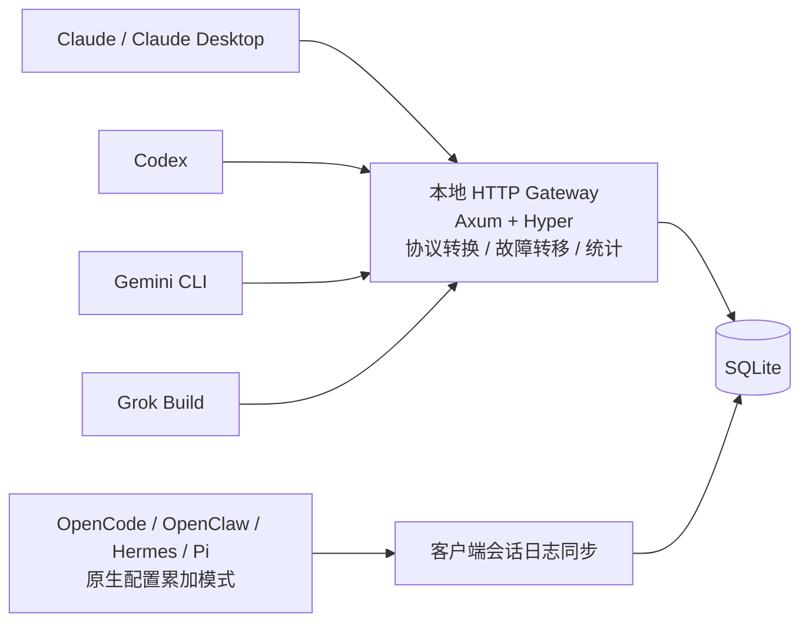
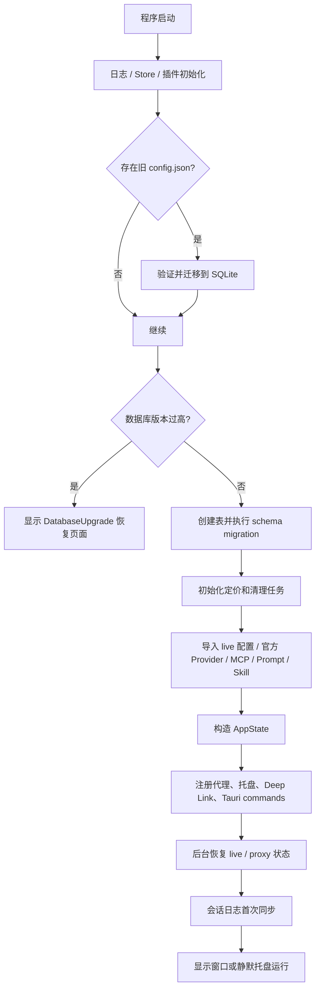
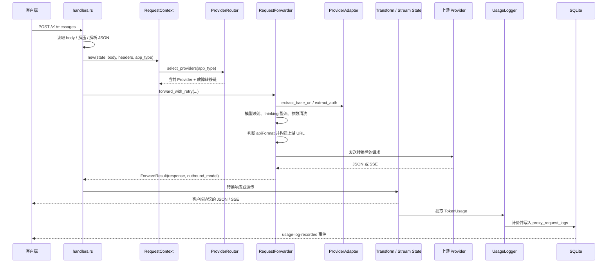
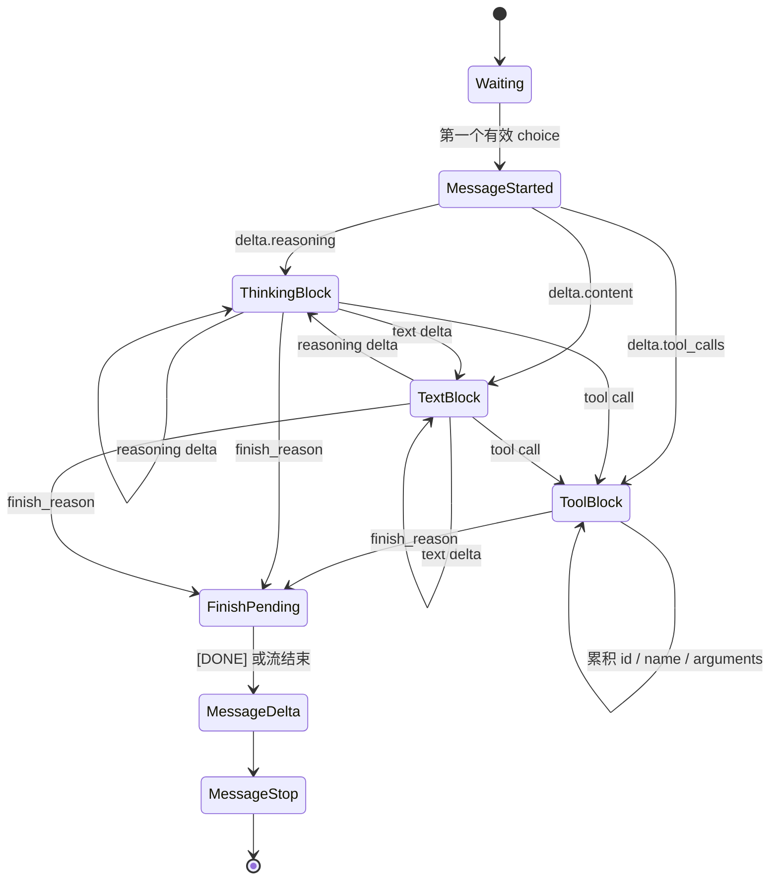
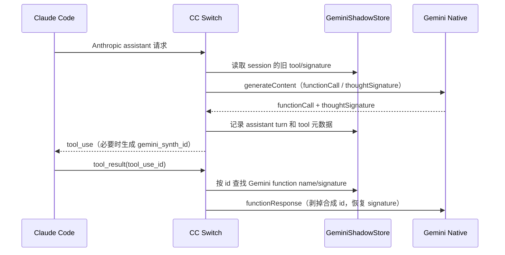
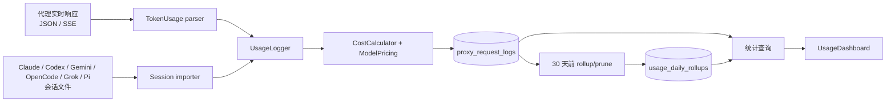
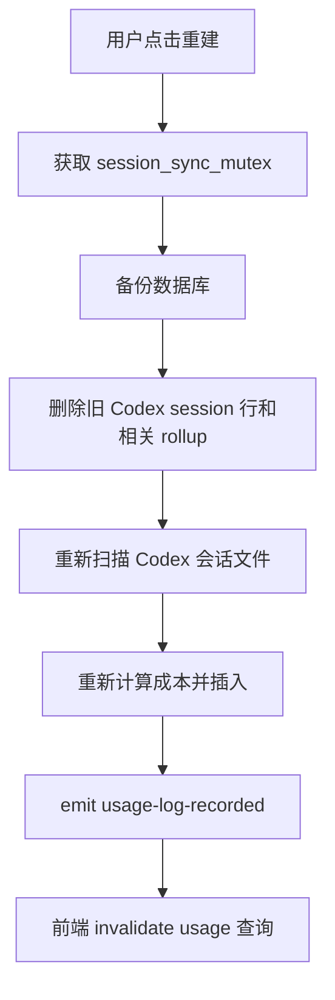
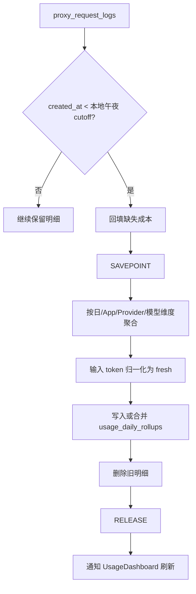

# CC Switch 代码导读：协议转换与用量统计

> 参考代码：`reference-projects/cc-switch`
>
> 代码版本：`v3.19.2`
>
> 参考提交：`3d126f4`
>
> 这份文档按当前仓库代码整理，重点放在本地代理、协议转换、流式响应和用量统计。以后重新打开项目时，先读这份文档，再按照文末的文件清单进入源码，基本可以直接接着分析。

---

## 1. 先记住这几个结论

CC Switch 表面上是一个管理 Claude、Codex、Gemini 等工具配置的桌面应用，真正复杂的部分在 Rust 后端。后端同时承担三类工作：

1. **配置管理**：把不同客户端的供应商配置保存到 SQLite，再投影回客户端的 live 配置文件。
2. **本地协议网关**：客户端把请求发给本机，网关根据供应商能力决定直通，还是把 Anthropic、OpenAI Chat、OpenAI Responses、Gemini Native 之间的协议互相转换。
3. **用量账本**：在响应结束时从 JSON 或 SSE 中提取 token，按照模型价格计算成本，写入请求明细；同时还会从各客户端自己的会话日志中补齐没有经过代理的用量。

协议转换和统计并不是两个完全独立的模块。转换层一旦改变了 token 字段的含义、模型名称或响应事件顺序，统计结果就会跟着变化。因此阅读代码时要始终沿着下面这条链看：

```text
客户端协议
    ↓
本地 handler 识别请求
    ↓
RequestContext 选择应用配置、Provider、Session
    ↓
RequestForwarder 做模型映射、认证、协议转换、请求转发
    ↓
上游响应
    ↓
响应转换 / SSE 状态机 / 透传
    ↓
TokenUsage 解析
    ↓
CostCalculator 计费
    ↓
proxy_request_logs
    ↓
统计查询、趋势图、请求明细、每日 rollup
```

最容易混淆的几个模型名也要先分清：

| 字段 | 含义 |
|---|---|
| `request_model` | 客户端原始请求里的模型名，可能只是 Claude Code 的别名 |
| `model` | 响应解析出来的模型名，或者没有响应回显时使用的兜底模型 |
| `outbound_model` | 代理最后真正发给上游的模型名，经过模型映射和协议转换后的真值 |
| `pricing_model` | 这一次请求实际拿来查价格的模型名，由 `pricing_model_source` 决定 |

默认按响应模型计价时，`pricing_model = model`；选择“按请求计价”时，`pricing_model = outbound_model`，不是 `request_model`。这条规则是处理模型别名和路由接管场景的关键。

---

## 2. 项目是什么样的

### 2.1 技术栈和边界

- 桌面壳：Tauri 2。
- 前端：React 18、TypeScript、Vite、TanStack Query、Tailwind、Recharts。
- 后端：Rust。
- 本地数据库：SQLite，通过 `rusqlite` bundled 运行。
- 本地代理：Axum 路由，底层使用 Hyper HTTP/1.1 accept loop。
- 网络客户端：Hyper/Reqwest 组合，支持 TLS、Socks、流式响应和多种压缩格式。
- 当前数据库 schema 版本：`src-tauri/src/database/mod.rs` 中的 `SCHEMA_VERSION = 17`。

入口文件：

| 位置 | 作用 |
|---|---|
| `src/main.tsx` | 前端启动、错误处理、React Query、主题和更新初始化 |
| `src/App.tsx` | 主窗口、应用切换、供应商列表和各功能页面的组合 |
| `src-tauri/src/main.rs` | Rust 二进制入口 |
| `src-tauri/src/lib.rs` | Tauri setup、数据库、托盘、Deep Link、命令注册、后台任务 |
| `src-tauri/src/store.rs` | 全局 `AppState` |
| `src-tauri/src/proxy/` | 本地协议网关、转发、转换、流式处理、统计 |
| `src-tauri/src/services/usage_stats.rs` | 统计聚合查询、定价回填和展示口径 |

### 2.2 应用类型分成两组

前端在 `src/config/appConfig.tsx` 中定义了九种 App ID：

```text
claude
claude-desktop
codex
gemini
grokbuild
opencode
openclaw
hermes
pi
```

后端 `AppType` 在 `src-tauri/src/app_config.rs` 中保持同一组名称。

真正拥有完整本地协议网关和故障转移数据面的 App 是：

```text
claude / codex / gemini / grokbuild
```

其中 `claude-desktop` 使用 Claude 侧的转换逻辑，但走独立的 `/claude-desktop/v1/*` 网关命名空间。

OpenCode、OpenClaw、Hermes、Pi 采用 **additive mode**：多个供应商可以并存，配置直接写入各自原生配置，不经过本地代理的 HTTP handler。当前用量统计管线里，OpenCode 和 Pi 主要依靠会话文件同步；OpenClaw、Hermes 没有接入这套完整的代理统计入口，不能把它们和 Claude、Codex、Gemini 的实时代理用量混为一谈。



---

## 3. 启动和运行时状态

### 3.1 `lib.rs::run` 做了什么

`src-tauri/src/lib.rs` 的 `run()` 很长，但可以按下面的顺序理解：

1. 注册 panic hook 和日志目录。
2. 初始化 Tauri 插件：单实例、Deep Link、Dialog、Process、Updater、Window State、Store 等。
3. 读取应用配置目录，默认是 `~/.cc-switch`，数据库是 `~/.cc-switch/cc-switch.db`。
4. 检查旧版 `config.json`，必要时迁移到 SQLite。
5. 先检查数据库 `user_version`，数据库版本过高时进入升级恢复页面，避免旧版本误改新数据库。
6. 初始化 SQLite、创建表、执行 schema migration、初始化模型定价。
7. 导入默认 Provider、MCP、Prompt、Skill 和原生 additive 配置。
8. 构造 `AppState`，把数据库、代理服务、用量缓存、Codex OAuth 管理器放进去。
9. 创建托盘菜单并注册 Deep Link。
10. 注册所有 `#[tauri::command]`。
11. 后台启动：
    - WebDAV/S3 自动同步 worker；
    - 崩溃后的 live 配置恢复；
    - Proxy 状态恢复；
    - 启动一次会话用量同步；
    - 之后每 60 秒同步一次会话日志；
    - 定期数据库备份和 rollup/prune。
12. 根据设置显示主窗口或静默运行在系统托盘中。



### 3.2 `AppState` 和 `ProxyState`

`src-tauri/src/store.rs` 中的 `AppState` 是 Tauri 共享状态：

```text
AppState
├── db: Arc<Database>
├── proxy_service: ProxyService
├── usage_cache: Arc<UsageCache>
└── codex_oauth_manager: Arc<CodexOAuthManager>
```

代理启动后，`src-tauri/src/proxy/server.rs` 再创建一个 `ProxyState`，它是一次 HTTP 请求所能看到的代理运行时状态：

```text
ProxyState
├── db
├── config / status
├── current_providers
├── provider_router                 熔断器和 Provider 选择
├── gemini_shadow                   Gemini thoughtSignature / tool state
├── codex_chat_history              Responses → Chat 的 tool call 历史
├── failover_manager
└── app_handle
```

`gemini_shadow` 和 `codex_chat_history` 不是普通缓存。它们保存的是协议转换时无法直接放进另一种协议、但下一轮请求又必须恢复的信息：

- Gemini 的 `thoughtSignature`；
- Chat Completions 转回 Responses 时需要恢复的 function call item；
- 某些上游把工具调用拆成多个事件，必须等状态机补齐后才能发给客户端。

---

## 4. 本地代理的 HTTP 入口

`src-tauri/src/proxy/server.rs::build_router()` 注册了这些主要路由：

| 本地路径 | 客户端协议 | handler |
|---|---|---|
| `/v1/messages`、`/claude/v1/messages` | Anthropic Messages | `handle_messages` |
| `/claude-desktop/v1/messages` | Claude Desktop 私有 gateway | `handle_claude_desktop_messages` |
| `/claude-desktop/v1/models` | Claude Desktop 模型列表 | `handle_claude_desktop_models` |
| `/chat/completions`、`/v1/chat/completions` | OpenAI Chat Completions | `handle_chat_completions` |
| `/responses`、`/v1/responses` | OpenAI Responses | `handle_responses` |
| `/grokbuild/v1/responses` | Grok Build Responses | `handle_grokbuild_responses` |
| `/responses/compact` | Codex Compact | `handle_responses_compact` |
| `/alpha/search` | Codex Alpha Search | `handle_alpha_search` |
| `/v1beta/*path` | Gemini Native | `handle_gemini` |
| `/health` | 健康检查 | `health_check` |
| `/status` | 代理状态 | `get_status` |

路由层只负责把请求送到正确的 handler。真正决定是否转换的是 Provider 配置和应用类型，而不是 URL 本身。

代理 server 使用手动 Hyper HTTP/1.1 accept loop，而不是直接用默认的 Axum serve，原因是要在 Hyper 把 header name 统一小写之前，通过 TCP peek 记录客户端原始的 header casing。转发到上游时，会尽量保持客户端原始 header 顺序和大小写，这对部分官方 CLI 的请求指纹很重要。

---

## 5. Provider、Adapter 和协议选择

### 5.1 Provider 元数据是转换开关

前端和后端共享的 `ProviderMeta` 在 `src/types.ts` / `src-tauri/src/provider.rs` 中定义。协议相关字段主要有：

```text
meta.apiFormat
├── anthropic
├── openai_chat
├── openai_responses
└── gemini_native
```

Codex 还会从 `settingsConfig.config` 里的 TOML `wire_api` 判断上游是 `chat`、`responses` 还是 Anthropic；新数据优先使用 `meta.apiFormat`，旧数据保留兼容读取。

在 Claude 适配器里，`get_claude_api_format()` 的优先级是：

1. 托管 OAuth Provider 的硬约束：`codex_oauth`、`xai_oauth` 永远使用 `openai_responses`；
2. `meta.apiFormat`；
3. 旧版 `settings_config.api_format`；
4. 旧版 `openrouter_compat_mode`；
5. 默认 `anthropic`。

这不是普通的 UI 偏好。它决定：

- 请求要不要转换；
- 请求路径要改成 `/v1/messages`、`/chat/completions` 还是 `/responses`；
- 响应返回给客户端时要用哪一个 SSE 状态机；
- usage 应该从哪一种响应字段提取。

### 5.2 三种 Adapter

`src-tauri/src/proxy/providers/adapter.rs` 定义统一的 `ProviderAdapter` trait：

```rust
trait ProviderAdapter {
    fn name(&self) -> &'static str;
    fn extract_base_url(&self, provider: &Provider) -> Result<String, ProxyError>;
    fn extract_auth(&self, provider: &Provider) -> Option<AuthInfo>;
    fn build_url(&self, base_url: &str, endpoint: &str) -> String;
    fn get_auth_headers(&self, auth: &AuthInfo) -> Result<Vec<(HeaderName, HeaderValue)>, ProxyError>;
    fn needs_transform(&self, provider: &Provider) -> bool;
}
```

实现位于：

- `providers/claude.rs`：Anthropic 兼容入口，也负责 Claude 客户端到 OpenAI/Responses/Gemini 的转换判定；
- `providers/codex.rs`：Codex、Grok Build 以及多个 OpenAI 兼容 additive Provider 的 URL、Bearer、wire API 判定；
- `providers/gemini.rs`：Gemini API Key 或 Gemini CLI OAuth，以及 Gemini Native URL。

认证方式和协议格式是两回事。例如：

- Claude 请求可能使用 `ANTHROPIC_AUTH_TOKEN`，但上游实际是 OpenAI Chat；
- Codex 请求可能走 Anthropic 上游，认证仍然可以是 `x-api-key` 或 Bearer；
- Gemini Native 可以用普通 API Key，也可以用 OAuth Bearer。

所以代码中把认证抽成 `AuthStrategy`，把结构转换抽成 `apiFormat`，不能把两者混在一起判断。

### 5.3 协议转换矩阵

下面是从客户端视角看的主要矩阵。表格中的“请求 → 响应”表示请求和响应分别要走相反方向的转换。

| 客户端 | 上游 Provider | 请求方向 | 响应方向 | 主要代码 |
|---|---|---|---|---|
| Claude / Claude Desktop | Anthropic | 直通 | 直通 | `ClaudeAdapter` |
| Claude / Claude Desktop | OpenAI Chat | Anthropic → Chat | Chat → Anthropic | `transform.rs`、`streaming.rs` |
| Claude / Claude Desktop | OpenAI Responses | Anthropic → Responses | Responses → Anthropic | `transform_responses.rs`、`streaming_responses.rs` |
| Claude / Claude Desktop | Gemini Native | Anthropic → Gemini | Gemini → Anthropic | `transform_gemini.rs`、`streaming_gemini.rs` |
| Codex Responses | Responses | 直通 | 直通 | `CODEX_PARSER_CONFIG` |
| Codex Responses | OpenAI Chat | Responses → Chat | Chat → Responses | `transform_codex_chat.rs`、`streaming_codex_chat.rs` |
| Codex Responses | Anthropic | Responses → Anthropic | Anthropic → Responses | `transform_codex_anthropic.rs`、`streaming_codex_anthropic.rs` |
| Codex Responses | xAI OAuth | Responses | Responses，附加 namespace flatten/restore | `transform_codex_responses_namespace.rs` |
| Codex Chat | OpenAI Chat | 直通 | 直通 | `handle_chat_completions` |
| Gemini Native | Gemini Native | 直通 | 直通 | `handle_gemini` |

对于 Codex，转换判定集中在 `providers/codex.rs`：

- `should_convert_codex_responses_to_chat()`；
- `should_convert_codex_responses_to_anthropic()`；
- `provider_needs_responses_namespace_flatten()`；
- `apply_codex_upstream_model()`；
- `resolve_codex_chat_reasoning_config()`。

---

## 6. 一次代理请求的完整流程

下面以 Claude 客户端调用 `/v1/messages` 为例。Codex 和 Gemini 的入口不同，但经过 `RequestContext`、`RequestForwarder`、响应处理和统计写入的主骨架是一致的。



### 6.1 Handler 阶段

以 `handlers.rs::handle_messages_for_app()` 为例：

1. 拆分 HTTP request，取出 method、URI、headers、extensions。
2. 读取请求体并解析为 `serde_json::Value`。
3. 创建 `RequestContext`。
4. 判断 `stream`。
5. 创建 `RequestForwarder`，调用 `forward_with_retry()`。
6. 成功后取出：
   - `response`：上游响应；
   - `provider`：实际成功的 Provider，可能不是最初的当前 Provider；
   - `outbound_model`：实际发出的模型；
   - `connection_guard`：活跃连接计数的 RAII guard。
7. 根据 Provider 的 `apiFormat` 进入转换分支或通用 `process_response()`。

失败时，handler 会把 `ForwardError.provider` 回填到上下文，记录失败请求，并返回客户端能理解的错误形状。Codex 还会把普通上游错误改造成 Responses 风格的 `{"error": {...}}`。

### 6.2 RequestContext 阶段

`src-tauri/src/proxy/handler_context.rs::RequestContext::new()` 负责一次请求的共同上下文：

- 读取当前 App 的 `AppProxyConfig`；
- 读取整流器、优化器和 Copilot 优化器配置；
- 提取请求模型；
- 提取 Session ID；
- 只调用一次 `ProviderRouter::select_providers()`，避免 HalfOpen 熔断探测名额被重复消耗；
- 记录 `current_provider_id`，用于故障转移后更新 UI 和托盘。

如果是 Gemini，模型名不在 JSON body，而在 URI 的 `/models/<model>` 段中，所以会额外调用 `with_model_from_uri()`。

### 6.3 ProviderRouter 和故障转移

`src-tauri/src/proxy/provider_router.rs` 的选择规则：

- 自动故障转移关闭：只返回当前 Provider；
- 自动故障转移开启：只按故障转移队列顺序返回 Provider；
- 熔断器 Open 的 Provider 被跳过；
- Codex Official 账号不能参与跨账号故障转移，因为入站请求携带的是被选中 ChatGPT 账号的 Authorization；
- 所有 Provider 都不可用时返回 `AllProvidersCircuitOpen` 或 `NoProvidersConfigured`。

`max_retries` 的含义是失败后的重试次数，因此最大尝试数是：

```text
max_attempts = max_retries + 1
```

Provider 错误才会污染健康度并触发故障转移，例如网络错误、超时、上游 5xx。客户端请求错误、参数转换失败、客户端主动断开不应该把 Provider 熔断。

### 6.4 RequestForwarder 阶段

`src-tauri/src/proxy/forwarder.rs::forward()` 的实际顺序很重要：

1. 从 Adapter 提取 `base_url`。
2. 判定 `is_full_url`、Copilot、Codex OAuth、xAI OAuth 等特殊 Provider。
3. 校验 Codex Official 的入站授权。
4. 应用模型映射：
   - Claude Desktop 用安全路由表把 `claude-*` 模型映射到真实模型；
   - 其他应用使用 `model_mapper`。
5. 规范化 thinking 类型。
6. Grok Build / Codex 根据 Provider 配置替换上游真实模型。
7. Copilot 做模型归一化和请求分类。
8. 根据协议转换需要重写 endpoint。
9. 根据 `apiFormat` 转换 request body。
10. 对 xAI 原生 Responses 做 namespace flatten 和私有字段清理。
11. 应用媒体降级、私有字段过滤和本地 request override。
12. 记录最终的 `outbound_model`。
13. 判断是否流式，必要时强制 `Accept-Encoding: identity`。
14. 获取认证头：普通 API Key、Bearer、GitHub Copilot OAuth、Codex OAuth、xAI OAuth 分别处理。
15. 保留安全的 header 顺序、注入 Account ID、Session header、Anthropic beta header、User-Agent。
16. 发送 HTTP 请求。

注意，**模型映射发生在结构转换之前**。这样转换器看到的模型已经是上游语义下的模型，reasoning 能力和定价才能正确判断。

### 6.5 活跃连接计数

`ActiveConnectionGuard` 在请求刚进入转发器时把 `active_connections` 加一。它不会在收到上游响应头后立刻减少，而是随着响应 body 一起流转：

- 非流式：函数结束时释放；
- 流式：guard 被 move 到 `create_logged_passthrough_stream()`，客户端收到完整 SSE 后才释放。

这样状态页显示的活跃连接不会在流式响应还没结束时提前归零。

---

## 7. 协议转换详解

### 7.1 Anthropic Messages ↔ OpenAI Chat Completions

核心文件：

- 请求/非流式响应：`src-tauri/src/proxy/providers/transform.rs`；
- OpenAI Chat SSE → Anthropic SSE：`src-tauri/src/proxy/providers/streaming.rs`；
- Claude 入口和 usage 收集：`src-tauri/src/proxy/handlers.rs`、`response_processor.rs`。

### 请求方向：Anthropic → Chat

`anthropic_to_openai_with_reasoning_content()` 主要做这些事情：

| Anthropic | OpenAI Chat |
|---|---|
| `model` | `model` |
| `system` 字符串或数组 | 首条 `role=system` message |
| `messages[].content[].text` | message `content` |
| `image` | OpenAI 多模态 `image_url` 结构 |
| `tool_use` | `assistant.tool_calls[]` |
| `tool_result` | 独立 `role=tool` message |
| `thinking` | 默认丢弃；特定 DeepSeek/MiMo Provider 可写入 `reasoning_content` |
| `max_tokens` | 普通模型写 `max_tokens`，o-series 写 `max_completion_tokens` |
| `stop_sequences` | `stop` |
| `tool_choice.any` | `required` |
| `input_schema` | `function.parameters`，并清理 schema |
| `stream=true` | 同时补 `stream_options.include_usage=true` |

系统提示会先剥掉 Claude Code 动态插入的 `x-anthropic-billing-header:` 首行。这个值会随请求变化，如果继续送给 OpenAI 上游，会破坏 prompt cache 的前缀复用。

工具参数使用 `canonical_json_string()` 序列化，目的是保证多轮工具调用的参数字节稳定。稳定的 JSON 文本对某些上游的 prompt cache 也有帮助。

### 响应方向：Chat → Anthropic

`openai_to_anthropic()` 把：

- `choices[0].message.content` 变成 `text` content block；
- `reasoning_content` 变成 `thinking` block；
- `tool_calls` 变成 `tool_use` block；
- `finish_reason` 映射成 `stop_reason`；
- OpenAI usage 转成 Anthropic 的四个 usage 桶。

如果 OpenAI 上游返回的是拒绝内容、数组形式 content 或兼容层的自定义字段，转换器尽量把它们降级为可见文本，而不是直接丢掉。

### 流式方向：OpenAI SSE → Anthropic SSE

`streaming.rs::create_anthropic_sse_stream()` 是一个增量状态机。它不会把每一个 OpenAI chunk 简单改名，而是维护：

```text
message_id
current_model
next_content_index
当前 thinking/text block
按 OpenAI index 保存的 tool call block
latest_usage
finish_reason
是否已发 message_start / message_delta / message_stop
```

Anthropic 流的生命周期要求比较严格：

```text
event: message_start
    ↓
event: content_block_start
    ↓
event: content_block_delta（可以很多个）
    ↓
event: content_block_stop
    ↓
event: message_delta（带 stop_reason 和 usage）
    ↓
event: message_stop
```

实现里有几个防御点：

1. OpenAI 的 reasoning 和 text 可能交替出现，转换器会关闭当前 block，再开新的 index。
2. tool call 的 `id`、`name`、`arguments` 可能分散在不同 chunk，必须先累积。
3. 一些网关会发送多个带 `finish_reason` 的 chunk，只有一个 `message_delta`，usage 取后面较完整的值。
4. 上游没有 `[DONE]` 但流自然结束时，补齐收尾事件。
5. Copilot 的工具参数可能出现无限空白，超过阈值后中止这个 tool call，避免代理一直输出无效数据。
6. 发送给上游的 Chat 请求必须注入 `stream_options.include_usage=true`，否则流末尾没有 usage，统计只能得到零 token。



### 7.2 Anthropic Messages ↔ OpenAI Responses

核心文件：

- `transform_responses.rs`；
- `streaming_responses.rs`；
- `handlers.rs::handle_claude_transform()`。

Responses API 和 Chat 最大的差异，不是字段名，而是它把消息内部的工具调用提升成了顶层 `input[]` / `output[]` item。

### 请求方向：Anthropic → Responses

`anthropic_to_responses()` 的主要映射：

```text
system                         → instructions
messages[].text                → input[].content[].input_text/output_text
assistant.tool_use             → input[].type=function_call
user.tool_result               → input[].type=function_call_output
thinking / redacted_thinking   → reasoning item（需要可恢复的签名时）
image                          → input_image
 document                       → input_file
max_tokens                     → max_output_tokens
thinking                       → reasoning.effort
```

Anthropic 的工具选择会转换成 Responses 的工具选择；Anthropic 的 Web Search 还要检查版本、`allowed_callers`、`blocked_domains` 和 `max_uses` 是否能被 Responses 表示。无法无损表示时，代码会拒绝请求，而不是静默改变用户意图。

对 Codex OAuth，转换器还会强制执行 ChatGPT Codex 后端的契约：

- `store=false`；
- `include` 必须包含 `reasoning.encrypted_content`；
- `stream=true`；
- 删除 ChatGPT 后端不接受的字段；
- 缺失时补 `instructions`、`tools`、`parallel_tool_calls`；
- FAST 模式注入 `service_tier=priority`。

### 响应方向：Responses → Anthropic

`responses_to_anthropic_with_web_search_options()` 先检查 Responses 顶层 `status`：

- `failed`、`cancelled` 或带 error 的 2xx 响应都会被当作错误；
- 不能看到 `output=[]` 就直接当成成功的空回答。

然后遍历 `output[]`：

| Responses item | Anthropic block |
|---|---|
| `message.output_text` | `text` |
| `message.refusal` | `text` |
| `function_call` | `tool_use` |
| `reasoning` | `thinking` 或 `redacted_thinking` |
| `web_search_call` | `server_tool_use` + `web_search_tool_result` |

Responses 的 `function_call.arguments` 是 JSON 字符串，转换器会解析成 Anthropic `tool_use.input` 对象。响应还会处理 URL citation，把引用附加到文本或 Sources 区域。

### Responses 的流式生命周期

Responses SSE 是命名事件状态机：

```text
response.created
    ↓
response.output_item.added
    ↓
response.content_part.added
    ↓
response.output_text.delta / response.reasoning_summary_text.delta
    ↓
response.content_part.done
    ↓
response.output_item.done
    ↓
response.completed
```

`streaming_responses.rs` 必须按 `item_id`、`output_index`、`content_index` 建立映射，不能只按事件到达顺序拼接。上游有时缺少其中一个索引，代码会保存已知 key，并在后续事件中合并；如果两个 key 明确冲突，则宁愿丢掉不确定的增量，也不把两段不同文本拼到一起。

### 7.3 Codex Responses ↔ OpenAI Chat

核心文件：

- `transform_codex_chat.rs`；
- `streaming_codex_chat.rs`；
- `codex_chat_history.rs`；
- `handlers.rs::handle_codex_chat_to_responses_transform()`。

这是当前代码中最容易出问题、也最值得单独记住的一条链：Codex 客户端按 Responses 协议工作，但很多中转服务只提供 Chat Completions。

### 请求方向：Responses → Chat

Responses 的：

```text
instructions                  → role=system
input[].input_text            → role=user
input[].output_text           → role=assistant
function_call                 → assistant.tool_calls
function_call_output          → role=tool
reasoning                     → reasoning_content / thinking 兼容字段
tools                         → Chat function tools
tool_choice                   → auto / required / function selector
max_output_tokens             → max_tokens 或 max_completion_tokens
```

工具必须先建立 `CodexToolContext`：

```text
Responses tool
├── function
├── namespace / plugin
├── custom
└── tool_search
        ↓
Chat function tool
        ↓
响应回来后按映射表恢复原始 Responses 名称和 namespace
```

namespace 工具在 Chat 中不能直接表达，代码会把它们展平成稳定的名称，例如 `namespace__tool`，并保存原始 namespace/name。恢复时不能只看名字，因为多个 namespace 可能有同名工具。

reasoning 的转换不是简单复制。`resolve_codex_chat_reasoning_config()` 会根据 Provider 声明的能力和模型目录决定：

- 是否支持 thinking；
- 是否支持 effort；
- 写入 `thinking`、`enable_thinking`、`reasoning_split`、`reasoning_effort` 还是 `reasoning.effort`；
- `max`、`xhigh`、`ultra` 是否需要压到上游支持的最高档；
- OpenCode Zen 是否按单个模型的 `reasoningLevels` 做钳制。

### 响应方向：Chat → Responses

`chat_completion_to_response()` 把 Chat 的单个 assistant message 变成 Responses 的 output item：

- 文本 → `message` / `output_text`；
- `reasoning_content`、`reasoning`、`reasoning_details` → Responses reasoning item；
- `tool_calls` → `function_call`、`custom_tool_call` 或 `tool_search_call`；
- finish reason → Responses `status`；
- usage → Responses `usage`。

如果上游返回错误，不能直接把 Chat 的错误 JSON 给 Codex。`handle_codex_chat_error_response()` 会把它规整成 Responses 的 `error` 结构，同时保留原始 HTTP 状态码。

### 流式方向：Chat SSE → Responses SSE

`streaming_codex_chat.rs::ChatToResponsesState` 保存：

```text
response_id / model / created_at
text state
reasoning state
inline <think> state
tool call 按 Chat index 的状态
output item 列表
latest_usage
finish_reason
CodexToolContext
```

它要处理两种 reasoning：

1. 上游直接给 `reasoning` 或 `reasoning_content`；
2. 上游把思考包在 `<think>...</think>` 文本里，需要先在缓冲区判断，再把前半段转成 reasoning 事件，剩余部分转成文本事件。

只有确定收到合法工具名后，才发送 `output_item.added`。如果流结束时工具调用没有名字，代码会记录 dropped tool call；如果本轮本来应该正常完成，却一个合法 tool call 都没有留下，会返回诊断性错误，避免 Codex 收到“completed 但没有工具”的假成功。

### 7.4 Codex Responses ↔ Anthropic Messages

核心文件：

- `transform_codex_anthropic.rs`；
- `streaming_codex_anthropic.rs`；
- `handlers.rs::handle_codex_anthropic_to_responses_transform()`。

这条路径用于 Codex 客户端连接只提供 Anthropic Messages 的上游。

请求方向的关键点：

- `instructions` 和历史 `system/developer` item 合并成 Anthropic `system`；
- `input[]` 重新组织成 Anthropic `messages[]`；
- `function_call` → `tool_use`；
- `function_call_output` → `tool_result`；
- Responses reasoning item 中的 `encrypted_content` 可以还原成带签名的 Anthropic thinking block；
- 没有合法的 leading user message 时会补一个空 user 或整理历史；
- 不完整的历史工具调用会被删除，避免 Anthropic 400；
- `reasoning.effort` 转成 Anthropic `thinking` 和 `budget_tokens`；
- `max_output_tokens` 转成 `max_tokens`，默认上限为 8192，并按 thinking budget 留出可见答案空间；
- 强制工具选择和 thinking 同时出现时，Anthropic 不能接受的组合会关闭 thinking，不能满足时直接返回可解释错误。

Anthropic thinking 的签名不能直接暴露给 Responses 客户端，所以代码使用带前缀的 URL-safe Base64 包装：

```text
ccswitch-anthropic-thinking-v1:<base64url(JSON thinking block)>
```

这不是给外部 API 的通用格式，而是 CC Switch 在两个协议之间保存原始签名的桥接载体。解码时会再次验证 block 类型和签名字段，防止把未经签名的内容伪装成历史 thinking。

### 7.5 Anthropic Messages ↔ Gemini Native

核心文件：

- `transform_gemini.rs`；
- `streaming_gemini.rs`；
- `gemini_shadow.rs`。

这条链只在 Claude/Claude Desktop Provider 的 `apiFormat=gemini_native` 时使用。Gemini App 自己的 `/v1beta/*` handler 是原生透传，不需要再把 Gemini 转成 Gemini。

请求方向：

```text
Anthropic system       → Gemini systemInstruction.parts[].text
user message           → contents[].role=user
assistant message      → contents[].role=model
text block             → parts[].text
image/document         → parts[].inlineData
Anthropic tool         → tools[].functionDeclarations
thinking / tool history → 结合 shadow store 恢复
```

响应方向：

```text
Gemini candidates[0].content.parts[].text
    → Anthropic text block
Gemini functionCall
    → Anthropic tool_use
Gemini functionResponse
    → Anthropic tool_result
Gemini usageMetadata
    → Anthropic usage
```

Gemini 的 `functionCall` 经常缺少 `id`。转换器会生成 `gemini_synth_<uuid>`，这个 ID 只给 Anthropic 客户端使用，下一轮送回 Gemini 时会剥掉。真实 Gemini ID 和合成 ID 的区别由前缀判断。

Gemini 还会返回 `thoughtSignature`。Anthropic block 没有对应字段，因此 `GeminiShadowStore` 按 `provider_id + session_id` 保存 assistant turn、tool call id、tool name 和 signature。下一次工具结果回来时，转换器按 tool id 找回 signature，再附加到 Gemini 的 functionCall 上。



---

## 8. 流式响应的共同处理方式

### 8.1 透传和转换都经过同一个 usage 观察层

`src-tauri/src/proxy/response_processor.rs` 有两个公共入口：

- `handle_streaming()`：原协议透传，但同时观察 SSE；
- `handle_non_streaming()`：读取完整响应，解压、解析 JSON、提取 usage，再把 body 返回客户端；
- `process_response()`：根据 `response.is_sse()` 自动选择上面两条路径。

流式时由 `create_logged_passthrough_stream()` 包住最终发给客户端的 stream。它一边把原始或转换后的 bytes yield 给客户端，一边：

1. 按 UTF-8 安全地拼接 chunk；
2. 按空行切出 SSE event；
3. 用 `StreamUsageEventFilter` 先做字符串预过滤；
4. 只对可能包含 usage 的 `data:` 解析 JSON；
5. 把事件放进 `SseUsageCollector`；
6. 超时或流结束时调用 collector 的 finish callback；
7. 释放 `ActiveConnectionGuard`。

关闭 `enable_logging` 后，代码会尽量跳过 SSE JSON 解析，避免统计关闭时还在热路径上做完整解析。

### 8.2 不同协议的 usage 事件过滤器

`handler_config.rs` 定义了四组 parser：

| 协议 | 流式过滤条件 | 解析器 |
|---|---|---|
| Claude | `message_start`、`message_delta` | `TokenUsage::from_claude_stream_events` |
| OpenAI Chat | 包含 `usage` | `from_openai_stream_events` |
| Codex Responses | `response.completed` 或 `usage` | `from_codex_stream_events_auto` |
| Gemini | `usageMetadata` | `from_gemini_stream_chunks` |

转换后的 SSE 仍然必须使用**客户端最终能看到的协议格式**来统计。例如 Claude → Responses → Claude 的链路，响应转换器最终给客户端的是 Anthropic SSE，所以 collector 用 Claude parser，而不是 Responses parser。

### 8.3 上游 stream:false 却返回 SSE

真实的第三方网关经常忽略 `stream:false`，或者返回 SSE 但错误地标成 `application/json`。代码有两层兜底：

- `body_looks_like_sse()` 检测 `data:`、`event:`、`id:`、`retry:` 或注释行；
- `responses_sse_to_response_value()` / `chat_sse_to_response_value()` 把 SSE 聚合成一个完整 JSON，再走正常的非流式转换器。

这样客户端要求非流时仍然收到 JSON，不会因为上游的错误 Content-Type 得到半截 SSE。

### 8.4 压缩、头部和 body 限制

- Codex 请求体可能是 zstd，解析前先解压；
- 非流式响应按 `content-encoding` 解压，并限制解压后的最大大小；
- 流式 SSE 通常强制 `Accept-Encoding: identity`，防止压缩后的 SSE 无法增量解析；
- 重建响应体后会移除 `content-encoding`、`content-length`、`transfer-encoding`；
- 响应侧会移除 hop-by-hop headers；
- 本地默认 body limit 为 200 MB，但上游仍可能有更小的 nginx 或网关限制。

---

## 9. 用量统计的数据流

用量数据有两个主要来源，最后都进入 `proxy_request_logs`：



### 9.1 代理实时记录

代理响应成功后，`response_processor.rs` 或各个 transform handler 会调用：

```text
TokenUsage parser
    ↓
model 归因
    ↓
UsageLogger::resolve_pricing_config()
    ↓
pricing_model 选择
    ↓
UsageLogger::log_with_calculation()
    ↓
CostCalculator::calculate_for_app()
    ↓
UsageLogger::log_request()
```

转发失败时，`handlers.rs::log_forward_error()` 会写一条没有 token、没有成本的错误请求行，保留状态码、错误文本、延迟和 session 关联。

### 9.2 会话日志记录

代理没有接管时，客户端仍会把 token 使用量写在自己的 session 文件里。应用启动时和之后的后台任务会增量扫描这些文件，再写入同一张 `proxy_request_logs` 表。

目前的来源包括：

| `data_source` | 来源 | provider_id 占位值 |
|---|---|---|
| `proxy` 或 NULL | 本地代理实时记录 | 实际 Provider ID |
| `session_log` | Claude Code JSONL | `_session` |
| `codex_session` | Codex 会话记录 | `_codex_session` |
| `gemini_session` | Gemini 会话记录 | `_gemini_session` |
| `opencode_session` | OpenCode 会话记录 | `_opencode_session` |
| `grok_session` | Grok Build 会话记录 | `_grok_session` |
| `pi_session` | Pi 会话记录 | `_pi_session` |

`src-tauri/src/services/session_usage.rs::sync_all_unlocked()` 统一调用各个专用 importer。整个同步由 `session_sync_mutex()` 串行保护，避免后台同步、手动同步和 Codex 重建同时改账本。

---

## 10. TokenUsage 的统一语义

### 10.1 内部结构

`src-tauri/src/proxy/usage/parser.rs` 定义：

```rust
struct TokenUsage {
    input_tokens: u32,
    output_tokens: u32,
    cache_read_tokens: u32,
    cache_creation_tokens: u32,
    model: Option<String>,
    message_id: Option<String>,
}
```

这里的 `input_tokens` **不保证在所有协议中含义相同**。代码用 `input_token_semantics` 记录落库时的口径，再在 SQL 聚合时统一成 fresh input。

### 10.2 各协议的原始字段

#### Claude / Anthropic

非流式：

```json
{
  "usage": {
    "input_tokens": 800,
    "output_tokens": 200,
    "cache_read_input_tokens": 300,
    "cache_creation_input_tokens": 100
  }
}
```

Anthropic 原生语义里，`input_tokens` 已经是**不含缓存的 fresh input**。缓存读和缓存写单独列出。

流式时：

- `message_start.message.usage` 通常给 input/cache；
- `message_delta.usage` 通常给 output；
- 某些中转会在 `message_delta` 给一个更小、更准确的 fresh input，解析器会在满足条件时采用后来的值；
- 不能简单把 start 和 delta 相加，否则会重复计数。

#### OpenAI Chat

```json
{
  "usage": {
    "prompt_tokens": 1000,
    "completion_tokens": 200,
    "prompt_tokens_details": {
      "cached_tokens": 300,
      "cache_write_tokens": 20
    }
  }
}
```

OpenAI 的 `prompt_tokens` 通常包含缓存读部分，解析器把它原样放入 `TokenUsage.input_tokens`，再通过 app 的 token semantics 在计费和聚合时扣除缓存。

缓存读取字段兼容：

```text
usage.cache_read_input_tokens
usage.input_tokens_details.cached_tokens
usage.prompt_tokens_details.cached_tokens
usage.prompt_cache_hit_tokens
```

缓存创建兼容：

```text
usage.cache_creation_input_tokens
usage.input_tokens_details.cache_write_tokens
usage.prompt_tokens_details.cache_write_tokens
```

#### OpenAI Responses

Responses 可能使用：

```text
input_tokens / output_tokens
input_tokens_details.cached_tokens
input_tokens_details.cache_write_tokens
```

也可能被兼容网关改成 Chat 风格的 `prompt_tokens` / `completion_tokens`。`from_codex_response_auto()` 通过字段存在性自动区分两种形态。

Codex 直接透传时，`input_tokens` 按 Responses 原始口径保存，通常是包含缓存的总输入；Claude → Responses → Claude 的转换路径则会先把 Responses usage 转成 Anthropic fresh-input 口径，再由 Claude parser 读取。

#### Gemini Native

Gemini 使用：

```json
{
  "usageMetadata": {
    "promptTokenCount": 8383,
    "candidatesTokenCount": 50,
    "thoughtsTokenCount": 114,
    "totalTokenCount": 8547,
    "cachedContentTokenCount": 20
  }
}
```

当前 parser 的计算是：

```text
input_tokens  = promptTokenCount
output_tokens = totalTokenCount - promptTokenCount
cache_read    = cachedContentTokenCount
```

因此 Gemini 和 OpenAI 一样，落库输入值属于 cache-inclusive 口径，聚合时需要归一化。

### 10.3 `has_billable_tokens()` 闸门

一个全 0 usage 可能只是转换器合成的空完成事件，并不代表真实调用没有成本。`TokenUsage::has_billable_tokens()` 只要以下任意一项大于 0，就认为有真实计费维度：

```text
input_tokens > 0
output_tokens > 0
cache_read_tokens > 0
cache_creation_tokens > 0
```

所以“只有 cache_read、input 和 output 都是 0”的请求仍然会被记录。需要注意，`has_billable_tokens()` 不是 `UsageLogger` 内部的统一拦截器，而是由各个 handler 在写入前决定是否调用的闸门：Claude 转换、Codex Chat/Anthropic 转换等路径会主动跳过全 0 usage；通用透传路径为了保留请求可观测性，解析不到 usage 时仍可能写入一条 token 和成本为 0 的明细行。排查“为什么多了一条 0 成本记录”时，要先确认请求走的是哪条响应处理路径。

---

## 11. 输入 token 语义归一化

### 11.1 三种落库标记

`src-tauri/src/services/sql_helpers.rs` 定义：

```text
INPUT_TOKEN_SEMANTICS_LEGACY = 0
INPUT_TOKEN_SEMANTICS_TOTAL  = 1
INPUT_TOKEN_SEMANTICS_FRESH  = 2
```

当前 cache-inclusive 的 App 白名单是：

```rust
["codex", "gemini", "grokbuild"]
```

写入代理日志时：

- Claude、Claude Desktop 等按 fresh 语义写 `2`；
- Codex、Gemini、Grok Build 按 total 语义写 `1`；
- 旧数据默认是 `0`，兼容旧版“只含 cache read、不含 cache write”的口径。

### 11.2 `fresh_input_sql()`

所有统计聚合都应该通过 `fresh_input_sql(alias)` 计算输入 token：

```text
如果 semantics = FRESH:
    fresh_input = input_tokens

如果 app_type 属于 codex/gemini/grokbuild，且 semantics = TOTAL:
    fresh_input = input_tokens - cache_read_tokens - cache_creation_tokens

如果 app_type 属于 codex/gemini/grokbuild，且 semantics = LEGACY:
    fresh_input = input_tokens - cache_read_tokens

其他情况:
    fresh_input = input_tokens
```

扣减使用保护条件，缓存数异常大于输入数时不产生负数，而是保留原始输入值。

这是一个必须遵守的约束：新增 App 或新增会话 importer 时，要同时检查：

1. Rust `CACHE_INCLUSIVE_APP_TYPES`；
2. Rust 写入时的 `input_token_semantics`；
3. SQL `fresh_input_sql()`；
4. 前端 `src/types/usage.ts` 中的镜像集合和显示逻辑。

### 11.3 成本公式

`src-tauri/src/proxy/usage/calculator.rs::CostCalculator` 使用 `rust_decimal::Decimal`，避免浮点误差。

对任意请求，先确定可按输入价计费的 fresh input：

```text
billable_input = fresh input
```

成本明细：

```text
input_cost          = billable_input × input_price_per_million / 1,000,000
output_cost         = output_tokens × output_price_per_million / 1,000,000
cache_read_cost     = cache_read_tokens × cache_read_price_per_million / 1,000,000
cache_creation_cost = cache_creation_tokens × cache_creation_price_per_million / 1,000,000

base_total = input_cost + output_cost + cache_read_cost + cache_creation_cost
total_cost = base_total × cost_multiplier
```

倍率只作用于总价，不改变各个基础成本字段。

例如，一个 OpenAI 风格请求有：

```text
prompt_tokens = 1000
cached_tokens = 300
output_tokens = 200
input price   = $3 / M
output price  = $15 / M
cache price   = $0.3 / M
multiplier    = 1.5
```

则：

```text
fresh input  = 1000 - 300 = 700
input cost   = 700 × 3 / 1M   = 0.002100
output cost  = 200 × 15 / 1M  = 0.003000
cache cost   = 300 × 0.3 / 1M = 0.000090
base total   = 0.005190
total cost   = 0.005190 × 1.5 = 0.007785
```

### 11.4 展示口径中的几个数

`UsageSummary` 返回：

```text
total_input_tokens          已归一化的 fresh input
total_output_tokens         output
 total_cache_read_tokens    cache read
 total_cache_creation_tokens cache creation
real_total_tokens           fresh input + output + cache read + cache creation
cache_hit_rate              cache read / (fresh input + cache read + cache creation)
```

`real_total_tokens` 才是“模型实际处理过的 token 总量”口径。

Provider、Model、Daily 统计中的 `total_tokens` 当前代码计算的是：

```text
fresh input + output
```

它没有把 cache read 和 cache creation 再加进去，因为这些列单独展示。看 Dashboard 时不要把 `UsageSummary.realTotalTokens` 和 `ProviderStats.totalTokens` 当成同一个字段。趋势接口的 `DailyStats.totalTokens` 也遵循这个口径；缓存读写仍分别由 `totalCacheReadTokens` 和 `totalCacheCreationTokens` 返回。

---

## 12. 成本模型和价格选择

### 12.1 Provider 级覆盖和 App 全局默认

`UsageLogger::resolve_pricing_config()` 的优先级：

1. Provider `meta.costMultiplier`；
2. 对应 App 的全局默认倍率；
3. 默认倍率 `1`。

计价模型来源同样先看 Provider `meta.pricingModelSource`，再看 App 全局设置：

```text
response  → 按响应解析出的 model 计价
request   → 按 outbound_model 计价
```

Claude Desktop 没有独立的全局 proxy_config 行，所以它继承 Claude 的全局倍率和计价模式，但 Provider 自己的 metadata 仍然按 `claude-desktop` 查找。

### 12.2 为什么要保存 `pricing_model`

路由接管时可能出现：

```text
客户端请求模型：claude-sonnet-4-6
代理映射后模型：kimi-k2
上游响应回显：kimi-k2
```

也可能上游不回显模型，或者回显一个别名。为了历史回填时不猜，写入明细时把当时实际查价格用的模型保存到 `pricing_model`。

数据库回填成本时遵循：

1. `pricing_model` 非空且不是占位符：只按它查价格；
2. 老数据没有 `pricing_model`：先按 `model` 查；
3. 只有 `model` 是 `unknown`、空字符串等占位符时，才允许退回 `request_model`；
4. 已经有正成本的行不重复回填；
5. 只有有 token 但成本为 0 的行进入回填。

这样新导入模型价格后，历史请求会重新计算，而不会因为把客户端别名当成真实模型而永久算错。

### 12.3 模型价格匹配

`usage_stats.rs` 的 `find_model_pricing_row()` 支持一系列归一化：

- 去掉 provider namespace，例如 `anthropic.claude-*`；
- 去掉 Claude Desktop 的非 Anthropic 前缀；
- 去掉 Bedrock 版本后缀；
- 去掉日期后缀；
- 去掉 reasoning effort 后缀；
- 精确匹配失败后，对已知模型家族做安全的前缀匹配。

前缀匹配只对明确的模型家族开启，避免把两个无关模型错误合并到同一价格。

---

## 13. 去重：代理日志和会话日志如何不重复计费

### 13.1 request_id 的生成

`TokenUsage::dedup_request_id()`：

- Claude 和 Claude Desktop 共用 `session:<message_id>`，这样代理日志可以和 Claude JSONL 会话日志使用同一个主键；
- Codex、Gemini 等使用带 App 和 Provider 作用域的形式：

```text
session:<app_type>:<provider_id>:<message_id>
```

- 上游没有可用 message ID 时使用 UUID。

### 13.2 `UsageLogger::log_request()` 的冲突处理

写入前会读取相同 request_id 的旧行：

1. 没有旧行：直接插入；
2. 旧行来自 `session_log`：允许代理实时日志替换旧会话日志；
3. 旧行也是 proxy 且 usage 语义完全一致：忽略，保证重复回调幂等；
4. request_id 相同但 usage 语义不同：生成
   `原request_id:collision:<semantic_sha256>`，避免静默覆盖另一笔请求。

比较的语义包含：App、Provider、model、token 四元组、输入语义和状态码，不只比较 request_id。

### 13.3 跨来源指纹去重

会话 importer 未必拿得到代理生成的同一个 message ID，所以还会使用 token 指纹和时间窗口：

```text
App 类型相同或 Claude ↔ Claude Desktop
模型相同，或一侧是 unknown
input / output / cache_read 相同
cache_creation 相同，部分会话源未知时允许缺失
created_at 在 ±600 秒内
```

`effective_usage_log_filter()` 在统计查询和 rollup 时过滤被成功 proxy 行覆盖的 session 行。这样即使两条记录都落过库，Dashboard 也不会双算。

Grok Build 使用单独的接管活动判断，因为会话日志是按轮次聚合的，和代理逐请求 token 指纹通常不会相等。Pi 使用 `session_usage_dedup` 保存更紧凑的语义去重账本。

### 13.4 Claude Desktop 的展示折叠

Claude Desktop gateway 的代理请求仍然以 `app_type='claude-desktop'` 写入，保留真实审计信息。Dashboard 查询时使用：

```sql
CASE WHEN app_type = 'claude-desktop'
     THEN 'claude'
     ELSE app_type
END
```

因此：

- Dashboard 的 Claude 统计包含 Claude Desktop gateway 流量；
- 请求详情仍能看到原始 `claude-desktop`；
- 不会让用户误以为 CC Switch 能统计 Claude Desktop 自己的全部聊天用量，因为 Desktop 普通聊天不经过这个 gateway。

---

## 14. 会话日志增量同步

### 14.1 Claude Code JSONL

`session_usage.rs::sync_claude_session_logs()`：

1. 扫描 `~/.claude/projects/`；
2. 扫描主会话 JSONL、`subagents/*.jsonl`、Workflow 子 agent JSONL；
3. 从 `session_log_sync` 读取文件 mtime 和行偏移；
4. 文件没有变化就跳过；
5. 从上次行偏移继续读；
6. 只处理 `type=assistant` 且带 `message.id` 和 `message.usage` 的行；
7. 同一个 message ID 出现多次时，优先有 `stop_reason` 的版本，再比较 output token；
8. 四个 token 桶任一非零就导入；
9. 按 message ID 和跨源指纹去重；
10. 更新同步游标。

这里没有强制要求 `stop_reason` 非空，因为 Workflow 和子 agent 的短请求可能只留下 message_start 快照，但 input/cache 已经产生真实成本。

### 14.2 其他客户端

- Codex：读取 Codex session/history 和 state 数据库，支持重建；
- Gemini：读取 Gemini session 文件；
- OpenCode：读取本地 session 记录；
- Grok Build：读取会话日志，明确记录 `input_token_semantics=TOTAL`；
- Pi：使用自己的 session 结构和 `session_usage_dedup`。

启动时会话同步在 `lib.rs` 中放到 `spawn_blocking`，避免大文件扫描堵住 Tokio 异步线程。之后每 60 秒执行一次。

### 14.3 Codex 用量重建

前端 Dashboard 的“重建 Codex 用量”调用 `rebuild_codex_usage`：



备份、删除、重导和通知在同一把同步锁保护下执行，避免后台 60 秒同步插入到删除和重建之间。

---

## 15. SQLite 表和关键字段

### 15.1 `proxy_request_logs`

这是代理日志和会话日志共用的明细表，当前主要字段如下：

| 字段 | 作用 |
|---|---|
| `request_id` | 主键，代理/会话去重使用 |
| `provider_id` | Provider ID；会话源使用 `_session` 等占位值 |
| `app_type` | `claude`、`codex`、`gemini` 等 |
| `model` | 响应或兜底模型 |
| `request_model` | 客户端请求模型 |
| `pricing_model` | 写入时实际查价格的模型 |
| `input_tokens` | 原始输入 token，是否含缓存由 semantics 决定 |
| `output_tokens` | 输出 token |
| `cache_read_tokens` | 缓存读取 token |
| `cache_creation_tokens` | 缓存创建 token |
| `input_token_semantics` | 0 legacy、1 total、2 fresh |
| `input_cost_usd` | 输入基础成本，不含倍率 |
| `output_cost_usd` | 输出基础成本 |
| `cache_read_cost_usd` | 缓存读取基础成本 |
| `cache_creation_cost_usd` | 缓存创建基础成本 |
| `total_cost_usd` | 四项基础成本加总后乘倍率 |
| `latency_ms` | 请求总延迟 |
| `first_token_ms` | 流式首个被收集事件的时间近似值 |
| `duration_ms` | 可选的响应持续时间 |
| `status_code` | HTTP 状态 |
| `error_message` | 失败请求的错误说明 |
| `session_id` | 会话关联 |
| `provider_type` | Provider 类型或 session source |
| `is_streaming` | 是否流式 |
| `cost_multiplier` | 写入时使用的倍率 |
| `created_at` | Unix 秒时间戳 |
| `data_source` | `proxy`、`session_log` 等来源 |

表上有 Provider、时间、model、session、status 等索引。

### 15.2 `usage_daily_rollups`

30 天以前的明细会汇总到这张表。主键维度是：

```text
date
app_type
provider_id
model
request_model
pricing_model
```

保留 `request_model` 和 `pricing_model` 是为了让长期数据仍然能解释“客户端请求了什么”和“最终按什么价格算”。rollup 中的 `input_tokens` 已经归一化为 fresh input，`input_token_semantics` 固定为 `FRESH`。

### 15.3 `model_pricing`

```text
model_id
 display_name
input_cost_per_million
output_cost_per_million
cache_read_cost_per_million
cache_creation_cost_per_million
```

价格以字符串存储，读取后转成 Decimal。启动时会 seed 内置定价，并可从 models.dev 同步。价格更新后会触发缺失成本回填。

### 15.4 `session_log_sync`

用于增量扫描：

```text
file_path
last_modified
last_line_offset
last_synced_at
```

### 15.5 `session_usage_dedup`

主要供 Pi 等 session importer 使用，存储：

```text
data_source
request_id
semantic_id
has_entry_id
```

它把较大的 session 语义去重信息压缩成稳定的指纹账本，避免只依靠明细行。

---

## 16. Rollup、保留期和统计查询

### 16.1 启动和周期维护

数据库初始化时会执行：

```text
cleanup_old_stream_check_logs(7)
rollup_and_prune(30)
PRAGMA incremental_vacuum
```

后台每天再执行一次数据库备份和维护。

### 16.2 `rollup_and_prune(30)` 的顺序

`database/dao/usage_rollup.rs` 的顺序不能随意调换：

1. 计算本地时间边界；
2. 找出严格早于本地午夜 cutoff 的明细；
3. 先做一次缺失成本回填；
4. 创建 SQLite SAVEPOINT；
5. 按日、App、Provider、model、request_model、pricing_model 聚合；
6. 把 cache-inclusive 行转换成 fresh input；
7. 与已有 rollup 行合并；
8. 删除已归档的明细；
9. release savepoint；
10. 通知前端重新查询。

cutoff 对齐到本地日历的下一个午夜，目的是保证最年轻的一条 rollup 是完整的一天。否则如果在当天中途剪枝，一天的数据会被拆成一半 rollup、一半 detail，范围查询很容易少算。



### 16.3 查询为什么同时读两张表

`usage_stats.rs` 的 summary、provider stats、model stats 和 trends 都遵守同一个原则：

```text
最近明细 = proxy_request_logs
完整历史日 = usage_daily_rollups
```

范围边界不完整的日期只读明细，不读对应 rollup；只有完全被范围覆盖的本地日才加入 rollup。这样不会在边界日重复统计或漏统计。

### 16.4 Dashboard 查询接口

Tauri commands 位于 `src-tauri/src/commands/usage.rs`：

```text
get_usage_summary
get_usage_summary_by_app
get_usage_trends
get_provider_stats
get_model_stats
get_request_logs
get_request_detail
get_model_pricing
update_model_pricing
update_model_pricing_batch
check_provider_limits
sync_session_usage
rebuild_codex_usage
get_usage_data_sources
```

前端封装在 `src/lib/api/usage.ts`，React Query hooks 在 `src/lib/query/usage.ts`。

### 16.5 趋势粒度

`get_daily_trends()`：

- 查询范围不超过 24 小时：按小时分桶；
- 查询范围超过 24 小时：按本地日分桶；
- 没有数据的桶也会补零，保证图表的时间轴连续；
- 前端 `UsageTrendChart` 使用唯一的原始时间戳作为 `xKey`，避免跨年份的同月同日互相覆盖。

### 16.6 前端刷新

Dashboard 有两种刷新机制：

1. 默认每 30 秒轮询，用户可以选择关闭、5 秒、10 秒、30 秒或 60 秒；
2. 后端写入日志时通过 `usage_events.rs` 发出 `usage-log-recorded`，200ms 防抖合并后，前端 `useUsageEventBridge()` 立刻 invalidate `usage` 命名空间。

因此正常情况下，既不会每个 token 事件都触发一次查询，也不会让用户等完整的 30 秒才看到新请求。

---

## 17. 统计页面各部分对应的查询

`src/components/usage/UsageDashboard.tsx` 的结构如下：

```text
全局范围和筛选
├── appType
├── providerName
├── model
└── time range

UsageHero
└── get_usage_summary

UsageTrendChart
└── get_usage_trends

RequestLogTable
└── get_request_logs + get_request_detail

ProviderStatsTable
└── get_provider_stats

ModelStatsTable
└── get_model_stats

PricingConfigPanel
└── get/update/delete_model_pricing

Codex maintenance
└── rebuild_codex_usage
```

筛选口径要注意两点：

- Provider 按展示名精确匹配，会话占位值会显示成 `Claude (Session)`、`Codex (Session)` 等；
- Model 筛选使用 `COALESCE(NULLIF(pricing_model, ''), model)`，和 Model 统计的分组口径一致。

前端切换 App 会清掉 Provider 和 Model 筛选；切换 Provider 会清掉 Model 筛选，避免留下当前范围内已经不存在的组合。

---

## 18. 失败、重试和统计之间的边界

### 18.1 Provider 重试不等于多条最终用量

`RequestForwarder` 可以先后尝试多个 Provider，但最终用量统计通常针对成功返回客户端的那条响应。Provider 健康状态和代理运行状态会记录每次尝试，账单明细则依靠 request_id、语义冲突处理和 session 去重避免把同一个客户端请求重复算成多次成功调用。

如果上游在第一次尝试已经实际消耗了 token 但连接在响应前断开，代理没有拿到合法 usage，就无法可靠地补出真实 token；这类请求最多留下失败日志。代码没有凭空估算 token。

### 18.2 流式响应一旦写出就不能换 Provider

故障转移只能发生在客户端还没有收到首字节之前。流已经开始向客户端写出后，再切到另一家 Provider 会把两段不同响应拼在一起，客户端无法恢复，所以：

- 首字节超时可以触发下一家 Provider；
- 上游连接错误发生在首包前可以触发下一家；
- 已经写出部分文本后发生 idle timeout，只能结束当前流并报错。

### 18.3 不要把健康统计和账单统计混为一谈

代理状态中的：

```text
total_requests
success_requests
failed_requests
success_rate
failover_count
```

是代理运行时计数，按客户端请求和 Provider 尝试过程更新。

Dashboard 的 `total_requests`、成本和 token 则来自 SQLite 账本，受：

- usage 是否被上游返回；
- session 去重；
- 时间范围；
- rollup 边界；
- 价格是否存在；
- status_code 是否成功；

共同影响。两者数值不一定相等，这是设计上的两个统计层次。

---

## 19. 修改协议转换时应该同时检查什么

如果要新增一种上游协议、增加一个转换方向，建议按下面的顺序改，避免只改了非流式而漏掉流式或统计。

### 19.1 请求侧

1. 在 `ProviderMeta.apiFormat` 或 Codex `wire_api` 中定义配置语义；
2. 在 `providers/claude.rs` 或 `providers/codex.rs` 增加协议判定；
3. 在 `forwarder.rs` 增加 endpoint 重写；
4. 实现 request body 转换；
5. 处理 model、tool、tool_choice、reasoning、image/document、cache 字段；
6. 处理认证头和 Provider 的特殊 header；
7. 记录最终 `outbound_model`。

### 19.2 响应侧

1. 非流式 JSON 转换；
2. 上游错误 JSON 转换；
3. 流式 SSE 状态机；
4. 错误事件、截断流、缺少 DONE、错误 Content-Type；
5. tool call 的 id、name、arguments 跨 chunk 累积；
6. thinking/reasoning 的字段兼容；
7. usage 提取配置和模型提取器；
8. stream:false 但返回 SSE 的聚合兜底。

### 19.3 统计侧

1. parser 是否能读取非流式 usage；
2. parser 是否能读取流式最终 usage；
3. input 是否包含 cache read/write；
4. 写入 `input_token_semantics` 的值；
5. `fresh_input_sql()` 是否需要加入 App；
6. `CostCalculator` 是否需要新语义；
7. request_id 是否稳定；
8. 响应模型缺失时是否回退到 `outbound_model`；
9. 转换器是否会生成全 0 usage；
10. session importer 是否会和 proxy 账单重复。

### 19.4 测试侧

优先看现有测试的组织方式：

- 协议转换单元测试：各 `transform_*.rs` 文件底部；
- SSE 测试：`streaming*.rs` 文件底部；
- usage parser：`proxy/usage/parser.rs`；
- 成本计算：`proxy/usage/calculator.rs`；
- 日志幂等和 request_id 冲突：`proxy/usage/logger.rs`；
- rollup：`database/dao/usage_rollup.rs`；
- 查询边界和去重：`services/usage_stats.rs`；
- 前端协议/用量组件：`tests/components`、`tests/lib`、`tests/types`。

---

## 20. 排查问题时的阅读路径

### 20.1 客户端收到 400 / 422

按这个顺序看：

```text
server.rs 路由
  → handlers.rs 对应 handler
  → forwarder.rs::forward
  → providers/codex.rs 或 claude.rs 的协议判定
  → transform_*.rs 请求转换
  → 最终 endpoint / body / headers
```

重点确认：

- endpoint 是否被重复加了 `/v1`；
- `wire_api` 和 `meta.apiFormat` 是否冲突；
- tool_choice 是否在 tools 被过滤后还残留；
- Anthropic thinking 和 forced tool 是否形成上游不接受的组合；
- Codex OAuth 是否误发了不属于官方 Responses schema 的字段；
- Responses namespace 是否需要 flatten。

### 20.2 客户端只收到半截流或一直等待

看：

```text
streaming.rs
streaming_responses.rs
streaming_codex_chat.rs
streaming_codex_anthropic.rs
response_processor.rs::create_logged_passthrough_stream
```

重点查：

- 是否发出了客户端要求的 `message_start` / `response.created`；
- 是否关闭了上一个 content block；
- 是否只发送了一次完成事件；
- 上游是否有 `[DONE]` 或 `response.completed`；
- response body 是否被错误压缩；
- 首字节或 idle timeout 是否触发；
- 转换是否已经写出首字节，导致不能再 fallback。

### 20.3 token 或成本不对

先不要看图表，直接查一条明细：

```text
proxy_request_logs
├── app_type
├── model
├── request_model
├── pricing_model
├── input_tokens
├── cache_read_tokens
├── cache_creation_tokens
├── input_token_semantics
├── cost_multiplier
└── data_source
```

然后按顺序确认：

1. parser 读到了哪一组上游字段；
2. input 是否包含 cache；
3. `input_token_semantics` 是否正确；
4. `pricing_model` 是否是预期的模型；
5. 模型定价是否存在；
6. 是否有 session/proxy 重复行；
7. 查询是否读了 detail 和 rollup 两份数据；
8. 是否命中了 `effective_usage_log_filter()`；
9. Dashboard 读取的是 `realTotalTokens` 还是某个不含 cache 的 `totalTokens`。

### 20.4 新窗口快速恢复项目上下文

推荐顺序：

1. 本文第 1、5、6、10、16 节；
2. `src-tauri/src/proxy/handlers.rs`；
3. `src-tauri/src/proxy/forwarder.rs`；
4. `src-tauri/src/proxy/providers/mod.rs`；
5. 按实际方向进入 `transform_*.rs` 和 `streaming_*.rs`；
6. 统计问题再看 `usage/parser.rs`、`usage/calculator.rs`、`usage/logger.rs`；
7. 最后看 `services/usage_stats.rs` 和 `database/dao/usage_rollup.rs`。

---

## 21. 关键文件速查

### 协议网关

| 关注点 | 文件 |
|---|---|
| Axum 路由和代理生命周期 | `reference-projects/cc-switch/src-tauri/src/proxy/server.rs` |
| Claude/Codex/Gemini handler | `reference-projects/cc-switch/src-tauri/src/proxy/handlers.rs` |
| 请求上下文 | `reference-projects/cc-switch/src-tauri/src/proxy/handler_context.rs` |
| 上游转发、认证、URL、模型映射 | `reference-projects/cc-switch/src-tauri/src/proxy/forwarder.rs` |
| Provider 选择和熔断 | `reference-projects/cc-switch/src-tauri/src/proxy/provider_router.rs` |
| Adapter trait | `reference-projects/cc-switch/src-tauri/src/proxy/providers/adapter.rs` |
| Claude Adapter 和 API format | `reference-projects/cc-switch/src-tauri/src/proxy/providers/claude.rs` |
| Codex wire API 和转换判定 | `reference-projects/cc-switch/src-tauri/src/proxy/providers/codex.rs` |
| Gemini Adapter | `reference-projects/cc-switch/src-tauri/src/proxy/providers/gemini.rs` |
| Provider 类型导出 | `reference-projects/cc-switch/src-tauri/src/proxy/providers/mod.rs` |
| 通用 Anthropic ↔ Chat | `reference-projects/cc-switch/src-tauri/src/proxy/providers/transform.rs` |
| Anthropic ↔ Responses | `reference-projects/cc-switch/src-tauri/src/proxy/providers/transform_responses.rs` |
| Responses ↔ Chat | `reference-projects/cc-switch/src-tauri/src/proxy/providers/transform_codex_chat.rs` |
| Responses ↔ Anthropic | `reference-projects/cc-switch/src-tauri/src/proxy/providers/transform_codex_anthropic.rs` |
| Anthropic ↔ Gemini | `reference-projects/cc-switch/src-tauri/src/proxy/providers/transform_gemini.rs` |
| OpenAI Chat SSE → Anthropic SSE | `reference-projects/cc-switch/src-tauri/src/proxy/providers/streaming.rs` |
| Responses SSE → Anthropic SSE | `reference-projects/cc-switch/src-tauri/src/proxy/providers/streaming_responses.rs` |
| Chat SSE → Responses SSE | `reference-projects/cc-switch/src-tauri/src/proxy/providers/streaming_codex_chat.rs` |
| Anthropic SSE → Responses SSE | `reference-projects/cc-switch/src-tauri/src/proxy/providers/streaming_codex_anthropic.rs` |
| Gemini SSE → Anthropic SSE | `reference-projects/cc-switch/src-tauri/src/proxy/providers/streaming_gemini.rs` |
| 通用响应、SSE usage 收集和超时 | `reference-projects/cc-switch/src-tauri/src/proxy/response_processor.rs` |
| 请求/响应转换 parser 配置 | `reference-projects/cc-switch/src-tauri/src/proxy/handler_config.rs` |

### 统计和账本

| 关注点 | 文件 |
|---|---|
| token 字段解析、协议差异、request_id | `reference-projects/cc-switch/src-tauri/src/proxy/usage/parser.rs` |
| Decimal 成本公式 | `reference-projects/cc-switch/src-tauri/src/proxy/usage/calculator.rs` |
| 价格、倍率、幂等写入 | `reference-projects/cc-switch/src-tauri/src/proxy/usage/logger.rs` |
| 输入 token 语义归一化 | `reference-projects/cc-switch/src-tauri/src/services/sql_helpers.rs` |
| summary、trends、Provider/Model stats、回填 | `reference-projects/cc-switch/src-tauri/src/services/usage_stats.rs` |
| rollup/prune | `reference-projects/cc-switch/src-tauri/src/database/dao/usage_rollup.rs` |
| 数据库表结构和 migration | `reference-projects/cc-switch/src-tauri/src/database/schema.rs` |
| Claude 会话 JSONL 同步 | `reference-projects/cc-switch/src-tauri/src/services/session_usage.rs` |
| Codex 会话同步 | `reference-projects/cc-switch/src-tauri/src/services/session_usage_codex.rs` |
| Gemini 会话同步 | `reference-projects/cc-switch/src-tauri/src/services/session_usage_gemini.rs` |
| OpenCode 会话同步 | `reference-projects/cc-switch/src-tauri/src/services/session_usage_opencode.rs` |
| Grok Build 会话同步 | `reference-projects/cc-switch/src-tauri/src/services/session_usage_grokbuild.rs` |
| Pi 会话同步 | `reference-projects/cc-switch/src-tauri/src/services/session_usage_pi.rs` |
| 统计 Tauri commands | `reference-projects/cc-switch/src-tauri/src/commands/usage.rs` |
| 前端 usage API | `reference-projects/cc-switch/src/lib/api/usage.ts` |
| React Query usage hooks | `reference-projects/cc-switch/src/lib/query/usage.ts` |
| Dashboard 页面 | `reference-projects/cc-switch/src/components/usage/UsageDashboard.tsx` |
| 趋势图 | `reference-projects/cc-switch/src/components/usage/UsageTrendChart.tsx` |
| 后端实时刷新事件 | `reference-projects/cc-switch/src-tauri/src/usage_events.rs` |
| 前端实时刷新 hook | `reference-projects/cc-switch/src/hooks/useUsageEventBridge.ts` |

---

## 22. 最后的整体心智模型

读 CC Switch 的代理代码时，可以把它看成一个“协议边界适配器 + 账本写入器”：

```text
客户端看到的协议
    ≠ 必然是上游的协议

请求转换负责把客户端语义送到上游
响应转换负责把上游事件还原成客户端生命周期
Token parser 负责从最终可观察的响应中提取用量
Cost calculator 负责把不同协议的输入语义统一后计价
Usage stats 负责把 detail、session、rollup 合并成稳定的展示口径
```

其中最重要的四条不变式是：

1. **模型映射先于协议转换**，并保存最终 `outbound_model`。
2. **流式响应必须维护协议生命周期**，不能只做字段重命名。
3. **输入 token 先标记语义，再在聚合时统一成 fresh input**，不能在每个 parser 里随意扣缓存。
4. **代理日志和会话日志必须去重**，否则成本、请求数和趋势都会被双算。

以后无论是增加供应商、支持新的上游网关、修复工具调用，还是修改 Dashboard 统计，都可以先定位它属于这四条不变式中的哪一条，再进入对应文件修改。
