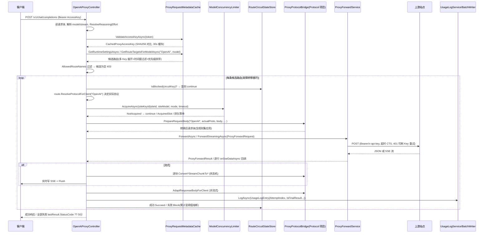

# 代理请求全链路（函数级）

> 本文是 [README.md](../README.md) 的代理转发细节篇。描述一次代理请求从进入 `/v1/*` 端点到返回客户端的完整调用链，精确到函数名与文件位置。
> 协议转换本身的语义（转换矩阵、usage 口径、流式状态机）见 [protocol-bridge.md](protocol-bridge.md)。

---

## 1. 入口总览

代理端点由 `src/AITool.Web/Controllers/Proxy/` 下两个控制器族承载，**不走 ASP.NET Core 认证**，由控制器自校验 AccessKey：

| 端点 | 方法 | Action（文件:行） | 说明 |
|------|------|-------------------|------|
| `/v1/chat/completions` | POST | `OpenAiProxyController.ChatCompletions`（`OpenAiProxyController.cs:371`） | OpenAI Chat 主入口 |
| `/v1/completions` | POST | `Completions`（`:322`） | legacy Completions：先转 Chat 复用主链路，响应再还原 |
| `/v1/embeddings` | POST | `Embeddings`（`:435`） | 禁流式，仅 OpenAI 协议路由（`routeEligibility` 过滤） |
| `/v1/responses` | POST | `Responses`（`OpenAiProxyController.Responses.cs:94`） | Responses 主入口（透传/降级/双重转换） |
| `/v1/responses` | GET(WS) | `ResponsesWebSocket`（`OpenAiProxyController.Responses.cs:24`） | WebSocket 会话模式 |
| `/v1/responses/compact` | POST | `ResponsesCompact`（`OpenAiProxyController.cs:479`） | 直接转发到 `Responses()` |
| `/v1/models` | GET | `Models`（`OpenAiProxyController.cs:171`） | 按 `x-api-key`/`anthropic-version` 头自动切 OpenAI/Anthropic 展示格式；按 AccessKey 路由限定过滤 |
| `/v1/models/{modelId}` | GET | `ModelDetail`（`:249`） | 不存在 → 403 `model_not_found`；无权限 → 403 `route_forbidden` |
| `/v1/messages` | POST | `AnthropicProxyController.Messages`（`AnthropicProxyController.cs:140`） | Anthropic 主入口 |
| `/v1/messages/count_tokens` | POST | `CountTokens`（`:109`） | 本地估算（`EstimateInputTokens` L1496，文本长度/4），不调上游 |
| `/health` | GET | `Program.cs:450` | `{status:"ok"}` |

OpenAiProxyController 拆 4 个 partial 文件：主文件（入口/通用链路）、`.Helpers`（认证/来源/追踪/日志辅助）、`.Streaming`（各流式桥接）、`.Responses`（Responses + WebSocket）。

---

## 2. 全链路时序（以 POST /v1/chat/completions 为例）

---

## 3. 阶段一：进入通用链路（`ProcessOpenAiLikeRequestAsync`）

`ChatCompletions`/`Responses`/`Completions`/`Embeddings` 都收敛到通用链路 `ProcessOpenAiLikeRequestAsync(routeLabel, requestBody, preparedClientRequestBody, requestPath, responseFactory, streamingBridgeFactory, ct, allowStreaming, defaultTargetPathFactory, routeEligibility)`（`OpenAiProxyController.cs:487`）。步骤：

1. **读取与解析请求体**：`StreamReader.ReadToEndAsync` → `JsonDocument.Parse` 提取 `model`/`stream`；`ResolveReasoningEffort`（`OpenAiProxyController.Helpers.cs:840`）兼容 `reasoning_effort` / `effort` / `reasoning.effort` / `output_config.effort` / `thinking.budget_tokens`（budget → low/medium/high 分档）。格式错 → 400 `invalid_body`
2. **AccessKey 认证**：取 `Authorization: Bearer` → `ProxyRequestMetadataCache.ValidateAccessKeyAsync`（`Services/ProxyRequestMetadataCache.cs:140`，SHA256 哈希后在缓存密钥表比对）→ 失败 401 `invalid_access_key`
3. **来源识别** `ResolveRequestSource(Request)`（Helpers L385）：`X-AITool-Source` 头优先（小写归一）；否则 User-Agent 关键字识别：`claude` → `claude-code`、`codex` → `codex`、`open-code`/`opencode` → `open-code`、`zcode` → `zcode`、`deepseek-harness` → `deepseek-harness`；兜底 `proxy`。写入 UsageLog 的 `Source` 字段，使用日志页据此展示品牌图标与筛选
4. **运行时设置** `_metadataCache.GetRuntimeSettingsAsync()`：超时/重试/并发模式/开发者开关
5. **开发者追踪** `TryCreateDeveloperTraceSafely`（Helpers L767 → `DeveloperInvocationTraceStore.AddRequest`，仅 `DeveloperFeaturesEnabled` 时）
6. **候选路由** `_metadataCache.GetRouteTargetsForModelAsync("OpenAI", modelName)`：查 `ProxyRouteRules` + 站点 + 映射 + 多 Key 展开（`CachedProxyRouteTarget` 列表），按 `ModelPriority`/`InstancePriority`/`Priority` 升序；`AvailabilityMode`+`TimeRangesJson` 时间窗过滤（`IsAvailableAt`）；每条候选带 `CircuitKey = BuildCircuitKey(siteId, siteKeyId, siteModelName)`（`ProxyRequestMetadataCache.cs:1513`，SHA256(SiteId+SiteKeyId+模型名) 前 16 字节合成 Guid —— **熔断键是站点+站点Key+模型维度**，路由规则增删重排不影响熔断，同站点同模型跨路由共享熔断、不同 Key 各自独立）
7. **AccessKey 路由限定**：`ProxyRequestMetadataCache.GetAllowedRouteNames(accessKey)` 过滤候选 → 空交集 403 `route_forbidden`；无任何路由 403 `no_available_route`

---

## 4. 阶段二：故障转移循环（`OpenAiProxyController.cs:557-810`）

`foreach (route in allRoutes)`，每条候选依次：

1. **客户端取消** → break
2. **熔断检查** `IsRouteBlockedSafely(route.CircuitKey)`（Helpers L925 → `RouteCircuitStateStore.IsBlocked`）→ 已熔断 continue（不消耗请求）
3. **协议决定** `route.ResolveProtocolForClient("OpenAI")`：Responses 能力优先于 OpenAI/Anthropic（`ProxyProtocolResolver`，Application 层）；`routeEligibility` 不满足（如 embeddings 仅 OpenAI）→ continue
4. **并发控制** `_concurrencyLimiter.AcquireAsync(RequestServices, route.SiteKeyId ?? route.SiteId, route.SiteModelName, concurrencyMode, concurrencyQueueTimeout, ct, displaySiteId)`（`Services/ModelConcurrencyLimiter.cs:143`）：
   - 上限来自 `GetModelConcurrencyLimitsAsync`（`{SiteKeyId|SiteId}:{Model}` → max，0=不限）
   - `SkipOnFull`：打满立即返回 NotAcquired → continue 下一条路由
   - `WaitForSlot`：入 FIFO 等待队列直到释放/超时 → 超时 continue
   - 槽位是 `IDisposable`，using 释放；`TryDeferRuntimeRouteTargetsRefresh` 与元数据缓存联动（调用中的模型路由快照稳定，见 §7）
5. **协议桥接（请求侧）** `ProxyProtocolBridge.PrepareRequestBody("OpenAI", actualProtocolType, preparedClientRequestBody, route.SiteModelName, enableStreaming, route.OverrideReasoningEffort, route.BaseUrl, route.CompatibilityRules, isPassthrough)` → 得到发往上游的最终请求体；`AddDeveloperTraceAttemptSafely` 记录转换后请求体（排查上游 400 的关键）
6. **组装 ProxyForwardRequest**：`TargetPath = SiteEndpointPathResolver.ResolvePath(...)`；`ForwardHeaders = MergeExtraHeaders(route.ExtraHeaders)`（Helpers L24；Codex 隐藏 Site 注入 Originator / ChatGPT-Account-Id / UA）；`RefreshTargetApiKeyAsync = CreateCodexCredentialRefreshCallback(route)`（Helpers L36，仅 `ManagedSource=="Codex"`，401 时实时刷新 OAuth 凭证）
7. **流式/非流式分支**（见 §5/§6）
8. **用量记录**：每次尝试 `SafeLogUsageAsync(new UsageLogEntry{...})`（Helpers L906）→ `IUsageLogService.LogAsync` → `ProxyUsageLogBatchWriter` 批量落库（同时 `SiteUsageTracker.RecordUsage` 零 DB 记录站点使用时间）。字段含 RequestId/AccessKeyId/ForwardingMode(`ResolveForwardingMode` Helpers L830: direct|bridge)/RetryCount/AttemptIndex/IsFinalResult/FallbackTriggered/三段 token/流式延迟/ReasoningEffort/Source/HttpStatusCode/ErrorCategory
9. **熔断回写**：成功 `SafeSucceedRoute`（L944，清失败计数）；失败 `SafeBlockRoute(circuitKey, CircuitRouteMeta)`（L962，累计至阈值熔断，meta 携带站点/模型名供面板展示）；失败明细 `SafeLogFailedProxyAttempt`（L997 → Error 日志）+ `SafeWriteConsoleProxyLog`（L1021，仅失败/中断时控制台单行摘要）+ `SafeCompleteDeveloperTraceAttempt`（L979）
10. 全部失败：返回 `lastResult.StatusCode ?? 502` + `{error:{message}}`（L812-814）

**回退语义**：只有「尚未向客户端写出首字节」的失败才允许 fallback 到下一条路由（流式一旦开始写即 `CanFallback=false`，避免半截响应后换站点重发）。

---

## 5. 阶段三A：流式转发（`streamingBridgeFactory` 选择）

| 上游协议 | 桥接函数（`OpenAiProxyController.Streaming.cs`） | Protocol 层转换 |
|----------|----------------------------------------------|-----------------|
| OpenAI | `ForwardOpenAiStreamPassthroughAsync`（L435） | 原样透传；`UpdateOpenAiUsageFromPayload` 提取 usage；`receivedDoneEvent` 兼容 `[DONE]` 与 `response.completed`；中断补发 `data: [DONE]` |
| Anthropic | `ForwardAnthropicStreamAsOpenAiAsync`（L805） | 事件级转换：message_start / content_block_delta(text_delta\|tool_use\|thinking_delta\|input_json_delta) / message_delta / message_stop → OpenAI chunk + finish + `[DONE]` |
| Responses | `ForwardResponsesStreamAsOpenAiAsync`（L656） | `ProxyProtocolBridge.ConvertResponsesStreamingToChat(state)` |
| legacy Completions | `ForwardOpenAiStreamAsCompletionsAsync`（L617）/ `ForwardAnthropicStreamAsCompletionsAsync`（L636） | 透传/桥接后逐块 `ConvertChatCompletionSseToCompletionsSse` |

底层统一 `IProxyForwardService.ForwardStreamingAsync(request, lineCallback, ct)`：`StreamReader.ReadLineAsync` 逐行读上游 SSE，每行回调 `onSseDataAsync`（控制器在回调中攒行成事件块 → 喂 Protocol 转换器 → `WriteChunkAsync` 写给客户端并 Flush，同时累积 ≤64KB 诊断副本）。

**Anthropic 客户端 `/v1/messages` 的对偶链路**（`AnthropicProxyController.cs`）：
- `ForwardAnthropicStreamPassthroughAsync`（L484）：Anthropic 原生透传；`UpdateAnthropicUsageFromPayload`（L1018）处理缓存 token 扣减语义（`message_start` 与 `message_delta` 重复累计时按覆盖语义取值，不重复累加）
- `ForwardOpenAiStreamAsAnthropicAsync`（L624）：OpenAI/Responses 上游 → Anthropic 事件流。Responses 上游时**双重转换**：先 `ConvertResponsesStreamingToChat`（Responses→Chat，`ResponsesToChatStreamState`）再 `ConvertOpenAiStreamChunkToAnthropic`（Chat→Anthropic，`AnthropicOpenAiStreamState`）。惰性首写：首个非空事件才 `BuildAnthropicStreamStart` 发 `message_start`；收尾 `CompleteAnthropicStream` 补齐未闭合块与 `message_delta`(usage 还原) + `message_stop`；整包 envelope 兼容 `IsOpenAiStreamingResponseEnvelope`（L919）与 `EnsureAnthropicStreamClosed`

**Responses WebSocket 模式**（`OpenAiProxyController.Responses.cs`）：
- `ResponsesWebSocket`（L24）→ 循环 `ReceiveWebSocketTextMessageAsync` → `TryNormalizeResponsesWebSocketRequest`（Helpers L83：处理 `response.create`/`response.append` 归一化与上下文合并、`ShouldReplaceResponsesWebSocketTranscript`（L192）完整转录替换、`DeduplicateResponsesWebSocketInputItems`（L234）按 id 去重）→ `ProcessResponsesWebSocketTurnAsync`（L442，每轮复用**完整故障转移链路**，会话状态存 `ResponsesWebSocketSessionState`，主文件 L44，保存上轮请求/output）
- 流式转换 `ForwardOpenAiResponsesAsWebSocketAsync`（Streaming L28）/ `ForwardAnthropicResponsesAsWebSocketAsync`（L146）；事件拆分 `ExtractWebSocketJsonPayloadsFromSseText`（Helpers L279）；完成输出提取 `TryExtractResponsesCompletedOutput`（L314）；错误帧 `WriteResponsesWebSocketErrorAsync`（L364）

---

## 6. 阶段三B：非流式转发

`_forwardService.ForwardAsync(forwardRequest, ct)`（`Infrastructure/Proxy/ProxyForwardService.cs:43`）：

1. 尝试次数 = `RetryCount+1`；带 `RefreshTargetApiKeyAsync` 回调再 +1（401 刷 Key 重发）
2. 每次尝试 linked CTS `CancelAfter(RequestTimeoutSeconds)` 控制超时（HttpClient.Timeout 为 InfiniteTimeSpan）
3. 非成功状态码读错误体；401 且未刷新过 → 回调取新 Key → `attempt--` 重试
4. **非流式请求但上游返回 SSE**（Codex `/responses` 强制 `stream=true`）→ `TryExtractResponsesCompletion` 透明聚合 `response.completed` 为完整 JSON；若 completed 的 `output` 为空则 `RebuildResponseWithDeltaMessage` 用累积的 `response.output_text.delta` 重建 assistant message
5. `ExtractUsageMetrics` → `ProxyProtocolBridge.ExtractUsageFromElement`（与协议层口径统一）；`HasUsableResponse` 判定有效性（error 非空/choices/output/content 数组检查）
6. 取消区分三种：客户端取消（直接返回 `IsCanceled=true` 不再重试）/ 内部超时（最后一次尝试才判失败）/ IOException/ObjectDisposedException（视为客户端断开）

成功后 `responseFactory` 回调 → `ProxyProtocolBridge.AdaptResponseBodyForClient("OpenAI", actualProtocolType, ...)` 转回客户端协议；**转换返回 `string.Empty` 视为失败**，保留 fallback 资格。

---

## 7. ProxyRequestMetadataCache 与延迟刷新

`Services/ProxyRequestMetadataCache.cs`（2077 行，Singleton，IMemoryCache）：

- **缓存策略**：TTL 30s 仅作兜底（`CacheDuration = TimeSpan.FromSeconds(30)`，L28，注释明确「从 5s 提高到 30s 以降低管理页面的重复查库压力」），主失效方式是管理后台写操作后的显式 `Invalidate*` 调用。所有查库走 `CreateIndependentClient()`（L126，独立 SqlSugar 连接 + PRAGMA）
- **核心读方法**：`ValidateAccessKeyAsync`(L140)、`GetAllowedRouteNames`(L158)、`GetRuntimeSettingsAsync`(L191)、`GetRouteTargetsForModelAsync`(L270，含多 Key 展开/时间窗/熔断键合成)、`GetChatModelsAsync`(L297)/`GetChatTargetsAsync`(L333/408)、`GetModelConcurrencyLimitsAsync`(L417)、`GetEnabledModelNamesAsync`(L234/248)、`GetAllRouteTargetsAsync`(L262)、`GetDeveloperDefaultAccessKeyAsync`(L797)、`GetCodexAccountsAsync`(L908) 等
- **失效族**：`InvalidateAccessKeys`(L882)、`InvalidateCodexAccounts`(L891)、`InvalidateCompatibilityProfiles`(L899)、`InvalidateRuntimeSettings`(L929)、`InvalidateRouteTargets`(L937)、`InvalidateRuntimeRouteTargets`(L946)、`InvalidateAdminRouteMetadata`(L963)、`InvalidateModelMetadata`(L1138)
- **延迟刷新**（调用中路由稳定）：`DeferRuntimeRouteTargetsRefresh`(L975) / `CompleteDeferredRuntimeRouteTarget`(L1028) —— 当某路由正在被使用时缓存刷新会推迟，配合 `ModelConcurrencyLimiter.TryDeferRuntimeRouteTargetsRefresh`（L450），保证进行中的请求模型路由不漂移；配套 `RouteTargetIdentity`/`ActiveRouteTargetSnapshot`（L1613-1618）

---

## 8. 熔断与并发（内存组件）

**RouteCircuitStateStore**（`Infrastructure/Proxy/RouteCircuitStateStore.cs`，Singleton 纯内存）：
- 键 = `BuildCircuitKey` 合成的 Guid（站点+站点Key+模型）
- `Block(routeId, meta?)`：连续失败 +1，达阈值（默认 5）写入 `_blockedRoutes[id]=now+blockDuration`；meta 供面板展示站点/模型归属
- `Succeed(routeId)`：清失败计数与 meta；`IsBlocked`：窗口判定 + 过期自动清理
- `GetAllCircuitStates()` / `Reset(routeId)` / `ResetAll()` / `UpdateOptions(blockDuration, failThreshold)`（系统设置修改时动态更新）
- 重启丢失（内存态）；调试工具「熔断监控」页签可视化并可手动解除

**ModelConcurrencyLimiter**（`Services/ModelConcurrencyLimiter.cs`，Singleton）：
- `AcquireAsync(...)`：读上限（0=不限）；SkipOnFull 打满返回 `NotAcquired`；WaitForSlot 入 FIFO（LinkedList waiter + TaskCompletionSource）等待释放/超时
- `ConcurrencyAcquireResult : IDisposable`（Dispose 幂等释放）；`UpdateLimit`（运行时改并发）；`ListActive`/`ListRecent(TimeSpan)`（调试页展示，Recent 保留 6h）
- 熔断的「兜底展示归属」：候选路由列表带 displaySiteId，面板可反查站点名

---

## 9. 管理端对话测试链路（ChatApiController，与代理链路的差异）

`Controllers/Admin/ChatApiController.cs`（JWT 认证）：`GET models` / `GET targets` / `GET models/{id}/targets` / `POST send`（非流式）/ `POST send-stream`（SSE：命名事件 `token`/`reasoning`/`meta`/`done`/`error`）。

与代理链路的差异：
- 复用同一套候选路由 + 故障转移 + 并发控制 + 协议桥接（`ProxyProtocolBridge` 同样被 ChatApiController 引用）
- **不触发熔断**（不调用 `circuitStore.Block()`），每次独立尝试
- `Source = "chat"`；无需 AccessKey（管理后台直接调用）
- 无路由规则时回退 `SiteModelMapping` 直接查询（`GetFallbackTargetAsync`）

---

## 10. 关键文件速查表

| 关注点 | 文件 |
|--------|------|
| 通用链路/故障转移循环 | `src/AITool.Web/Controllers/Proxy/OpenAiProxyController.cs` |
| 认证/来源/追踪/日志辅助 | `src/AITool.Web/Controllers/Proxy/OpenAiProxyController.Helpers.cs` |
| 流式桥接 | `src/AITool.Web/Controllers/Proxy/OpenAiProxyController.Streaming.cs` |
| Responses + WebSocket | `src/AITool.Web/Controllers/Proxy/OpenAiProxyController.Responses.cs` |
| Anthropic 入口 | `src/AITool.Web/Controllers/Proxy/AnthropicProxyController.cs` |
| 上游转发/重试/超时/SSE 读取 | `src/AITool.Infrastructure/Proxy/ProxyForwardService.cs` |
| 协议转换 | `src/AITool.Protocol/ProxyProtocolBridge.*.cs`（6 个 partial） |
| 热路径缓存/熔断键合成 | `src/AITool.Web/Services/ProxyRequestMetadataCache.cs` |
| 并发闸门 | `src/AITool.Web/Services/ModelConcurrencyLimiter.cs` |
| 熔断存储 | `src/AITool.Infrastructure/Proxy/RouteCircuitStateStore.cs` |
| 用量批量写 | `src/AITool.Infrastructure/Proxy/ProxyUsageLogBatchWriter.cs` |
| 协议透传/桥接判定 | `src/AITool.Application/Proxy/ProxyProtocolResolver.cs` |
| 端点路径解析 | `src/AITool.Application/Sites/SiteEndpointPathResolver.cs` |
